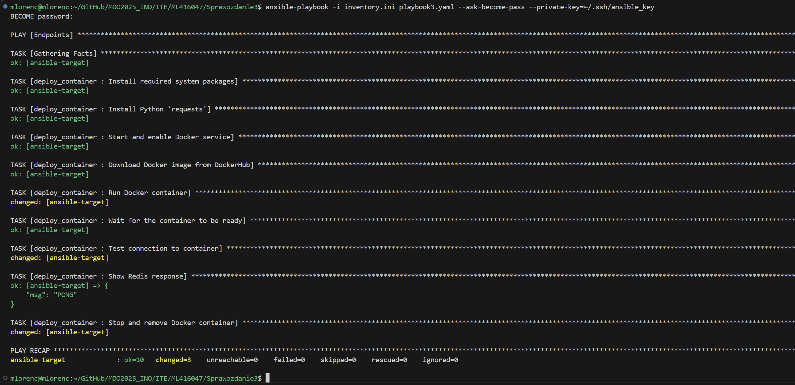
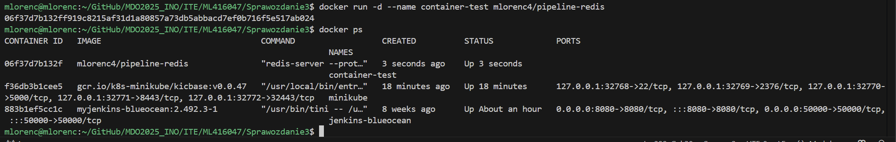
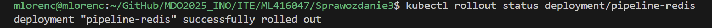

#Sprawozdanie 3

## Automatyzacja i zdalne wykonywanie poleceń za pomocą Ansible

### Instalacja zarządcy Ansible
Utworzenie nowej maszyny wirtualnej nazwanej `ansible` (w Hyper-V) oraz hostname `ansible-target`


Instalacja programu `tar` oraz `openssh-server` na maszynie `ansible`:
```
sudo dnf install tar openssh-server -y
```


Instalacja programu `Ansible` na maszynie hoście:
```
sudo dnf install ansible -y
```


Wymiana kluczy SSH między użytkownikiem na głównej maszynie a użytkownikiem ansible, w celu wyeliminowania konieczności podawania hasła podczas logowania przez SSH. Ponieważ klucz publiczny został już utworzony wcześniej, przeprowadzono wymianę kluczy za pomocą odpowiedniego polecenia. Powstał jednak problem, gdyż system nie rozpoznawał domyślnej lokalizacji pliku z kluczem SSH. W związku z tym konieczne okazało się ręczne wskazanie ścieżki do pliku z kluczem w parametrze komendy służącej do wymiany kluczy.
```
ssh-copy-id -i ~/GitHub/sshklucz.txt.pub ansible@ansible-target
```

### Inwentaryzacja

Sprawdzenie połączenia pomiędzy maszynami za pomocą polecenia `ping`:


Ustawienie nazw dla maszyn wirtualnych:


Utworzenie pliku inwentaryzacji zawierającego sekcje Orchestrators (maszyny zarządzające innymi) oraz Endpoints (maszyny docelowe). Dodano w odpowiednich sekcjach nazwy maszyn, ich adresy IP oraz nazwy użytkowników:
```
[Orchestrators]
HHost ansible_host=172.27.255.195 ansible_user=mlorenc

[Endpoints]
ansible-target ansible_host=172.27.254.57 ansible_user=ansible
```


### Zdalne wywoływanie procedur
Utworzenie `playbooka`
```
- hosts: all
  become: yes
  tasks:
    - name: Ping machines
      ansible.builtin.ping:

    - name: Copy inventory file
      ansible.builtin.copy:
        src: ./inventory.ini
        dest: /tmp/inventory.ini

    - name: Update all packages
      ansible.builtin.dnf:
        name: '*'
        state: latest
        update_cache: yes

    - name: Restart sshd and rngd
      ansible.builtin.systemd:
        name: "{{ item }}"
        state: restarted
      loop:
        - sshd
        - rngd
```

Wykonanie komendy `ansible-playbook` wymagało opcji `--ask-become-pass` proszącej o hasło roota, by przeprowadzić niektóre z operacji. Z powodu różnicy w hasłach między maszynami, komendę uruchomiono dwa razy z różnymi podanymi hasłami.


Pierwsze wywołanie dla `ansible-target` nie powiodło się w pełni z powodu braku `rngd` w systemie, doinstalowałem je za pomocą komendy:
```
sudo dnf install rng-tools
```
Pozwoliło to również na pokazanie różnicy w wynikach wywołanej komendy, gdyż pole `Copy inventory file` zmieniło status z `changed` na `ok`.

Wyłączenie serwera `ssh`:
```
sudo systemctl stop sshd
```


### Zarządzanie stworzonym artefaktem
Zadanie wymagało zbudowania i uruchomienia kontenera z opublikowanego na Docker Hubie obrazu (będącego artefaktem z poprzedniego pipeline'u) oraz połączenia się z nim, wykorzystując do tego playbook Ansible.

Playbook:
```
---
- hosts: Endpoints
  become: yes
  tasks:
    - name: Install required system packages
      ansible.builtin.dnf:
        name:
          - python3-packaging
          - python3-pip
          - docker
          - redis
        state: present
        update_cache: yes

    - name: Install Python 'requests'
      ansible.builtin.pip:
        name: requests
        executable: pip3

    - name: Start and enable Docker service
      ansible.builtin.service:
        name: docker
        state: started
        enabled: yes

    - name: Download Docker image from DockerHub
      ansible.builtin.docker_image:
        name: mlorenc4/pipeline-redis:latest
        source: pull

    - name: Run Docker container
      ansible.builtin.docker_container:
        name: pipeline-redis
        image: mlorenc4/pipeline-redis:latest
        state: started
        ports:
          - "6379:6379"

    - name: Wait for the container to be ready
      ansible.builtin.wait_for:
        host: "ansible-target"
        port: 6379
        state: started
        delay: 10
        timeout: 60
        msg: "Redis is not available on port 6379"

    - name: Test connection to container
      command: redis-cli -h ansible-target -p 6379 ping
      register: redis_ping

    - name: Show Redis response
      debug:
        msg: "{{ redis_ping.stdout }}"

    - name: Stop and remove Docker container
      ansible.builtin.docker_container:
        name: pipeline-redis
        state: absent
        force_kill: yes
```

Playbook obejmuje instalację niezbędnych narzędzi (m.in. Redis), pobranie opublikowanego obrazu Dockerowego, uruchomienie kontenera, przetestowanie połączenia z zewnątrz, a na końcu – zatrzymanie i usunięcie kontenera.


Utworzenie nowej roli do zarządzania stworzonym kontenerem:
```
ansible-galaxy init deploy_container
```


Konfiguracja roli polegała na skopiowaniu zawartości [playbooka 2](./playbook2.yaml) do deploy_container/tasks/[main.yml](./deploy_container/tasks/main.yml). Część zmiennych została zastąpiona symbolicznymi nazwami zdefiniowanymi w deploy_container/defaults/[main.yml](./deploy_container/defaults/main.yml). Utworzono `playbook3` korzystający z nowej roli.




## Pliki odpowiedzi dla wdrożeń nienadzorowanych

Plik konfiguracyjny skopiowany z `/root/anaconda-ks.cfg`, formatuje całość swojego dysku, nazwa hosta jest ustawiona na `Malachiasz` oraz zawiera odnośniki do potrzebnych repozytoriów:


Wskazanie zdalnego pliku odpowiedzi w instalacji poprzez parametr `inst.ks=[adres URL do pliku Kickstart]`


Zmodyfikowane parametry jądra:


Instalacja systemu:


Uruchomienie maszyny z pierwotnymi ustawieniami:


Działanie maszyny po ponownej instalacji z nowymi ustawieniami z pliku [anaconda-ks-2](./anaconda-ks-2.cfg):
```
# Generated by Anaconda 41.35
# Generated by pykickstart v3.58
#version=DEVEL

keyboard --vckeymap=pl --xlayouts='pl'
lang pl_PL.UTF-8

network --bootproto=dhcp --device=enp0s3 --ipv6=auto --activate
network --hostname=MSI

# Run the Setup Agent on first boot
firstboot --enable

url --mirrorlist=http://mirrors.fedoraproject.org/mirrorlist?repo=fedora-41&arch=x86_64
repo --name=update --mirrorlist=http://mirrors.fedoraproject.org/mirrorlist?repo=updates-released-f41&arch=x86_64

# Generated using Blivet version 3.11.0
ignoredisk --only-use=sda
# Partition clearing information
clearpart --all --initlabel
# Disk partitioning information
autopart

# System timezone
timezone Europe/Warsaw --utc

# Root password
rootpw --iscrypted --allow-ssh $y$j9T$KSEGChrZJLvmEOIhngOstxPa$nVl1KcKl9yq9Ds9ySNdtvUo./uYWQvyvbKdkWsNZkr5
user --groups=wheel --name=tmandat --password=$y$j9T$/jeTBjygnoX1mhh97mAtNS/o$Zx0ew2.d0O78RGdMMrJ0RkPPdwMr8oApMwHxWCumCF7 --iscrypted --gecos="Tomasz Mandat"

%packages
@^server-product-environment
docker
wget
%end

%post --log=/root/ks-post.log --interpreter=/bin/bash

systemctl enable docker

cat << 'EOF' > /usr/local/bin/start-redis-app.sh
#!/bin/bash
until systemctl is-active --quiet docker; do
  sleep 1
done
if ! docker ps -a --format '{{.Names}}' | grep -q '^redis-app$'; then
  docker run -d --name redis-app -p 6379:6379 tomaszek03/redis-app
fi
EOF

chmod +x /usr/local/bin/start-redis-app.sh

echo "[Unit]
Description=Start Redis container
After=network-online.target docker.service
Requires=docker.service

[Service]
ExecStart=/usr/local/bin/start-redis-app.sh
Type=oneshot
RemainAfterExit=yes

[Install]
WantedBy=multi-user.target
" > /etc/systemd/system/redis-container.service

systemctl enable redis-container.service

%end

reboot
```


## Kubernetes

### Instalacja klastra Kubernetes

Instalacja `minikube` jako paczka RPM dzięki komendom (pobranie oraz instalacja):
```
curl -LO https://storage.googleapis.com/minikube/releases/latest/minikube-latest.x86_64.rpm
sudo rpm -Uvh minikube-latest.x86_64.rpm
```


Alias dla kubectl:
```
alias kubectl="minikube kubectl --"
```

Uruchomienie Kubernetesa


Uruchomienie Kubernetes dashboard


Wyświetlenie dashboardu w oknie przeglądarki


### Analiza posiadanego kontenera

Sprawdzenie działanie obrazu programu `Redis` publikowanego na `DockerHub`


### Uruchamianie oprogramowania

Uruchomienie programu `Redis` i wykazanie działanie poprzez polecenie `kubectl get pods`:


Alternatywnie na Dashboard


Przekierowanie portu


Potwierdzenie połączenia przez `redis-cli`:


### Przekucie wdrożenia manualnego w plik wdrożenia

Przygotowanie pliku wdrożenia `redis-deplyment.yaml`:
```
apiVersion: apps/v1
kind: Deployment
metadata:
  name: pipeline-redis
spec:
  replicas: 4
  selector:
    matchLabels:
      app: pipeline-redis
  template:
    metadata:
      labels:
        app: pipeline-redis
    spec:
      containers:
        - name: redis-container
          image: mlorenc4/pipeline-redis
          ports:
            - containerPort: 6379
```

Zwiększenie liczby replik w Deployment do 4 poprawia odporność aplikacji na awarie, zapewniając ciągłość działania. Dodatkowo umożliwia skalowanie i równoważenie obciążenia, rozkładając ruch użytkowników między wiele podów i zapobiegając przeciążeniu pojedynczych instancji.

Nowy deployment:


Sprawdzenie stanu (zakończony sukcesem):


Eksportowanie portu, by program działał z zewnątrz:


Przekierowanie portu do serwisu


Sprawdzenie działania poprzez polecenie `ping`:


Utworzony Deployment w Dashboardzie (Workload Status, Deployments oraz Pods):


### Przygotowanie nowego obrazu

Niedziałający `redis`:
```
FROM redis-builder AS builder
FROM ubuntu:latest

RUN apt-get update && \
    apt-get install -y libjemalloc2 && \
    rm -rf /var/lib/apt/lists/*

COPY --from=builder /app/redis/src/redis-server /usr/local/bin/
COPY --from=builder /app/redis/src/redis-cli /usr/local/bin/

EXPOSE 6379

ENTRYPOINT ["/usr/bin/false"]
CMD ["--protected-mode", "no"]
```

![damaged-version]
![docker-login]
![docker-push]
![Dockerhub-images]

### Zmiany w deploymencie

Wprowadzanie zmian w deploymencie poprzez zmianę replik, zatwierdzane poleceniem:
```
kubectl apply -f redis-deployment.yaml
```

Zwiększenie liczby do 8:
![8repl]

Zmniejszenie do 1:
![1repl]

Zmniejszenie do 0:
![0repl]

Zwiększenie do 4:
![4repl]

Zmniejszenie do 1:
![4-1repl]

Starszy obraz w podzie:
![old-pod]

Historia deploymentu:
![kub-rollout]

Błąd deploymentu:
![damaged]

Porażka wdrożenia błędnego deployu:
![damaged-deploy]

Przywrócenie poprzedniej działającej wersji komendą:
```
kubectl rollout undo deployment/redis-app
```

![rollout-undo]

Działanie podów na starej wersji:
![old-pod-deploy]

Historia deploymentu po cofnięciu:
![kub-rollout-hist-2]

### Kontrola wdrożenia

Informacje o konkretnym wdrożeniu:


Skrypt weryfikujący czas wdrażania:
```
#!/bin/bash

DEPLOY_NAME=$1
TIMEOUT=60

echo "Waiting for deployment $DEPLOY_NAME to be ready..."
minikube kubectl -- wait --for=condition=available --timeout=${TIMEOUT}s deployment/${DEPLOY_NAME}
if [ $? -ne 0 ]; then
    echo "Deployment $DEPLOY_NAME did not become available within ${TIMEOUT} seconds."
    exit 1
fi
echo "Deployment $DEPLOY_NAME is now available."
```

Sprawdzenie czasu wdrażania:


### Strategie wdrożenia

Recreate

Rolling Update

Canary Deployment workload


bla bla
![candash]