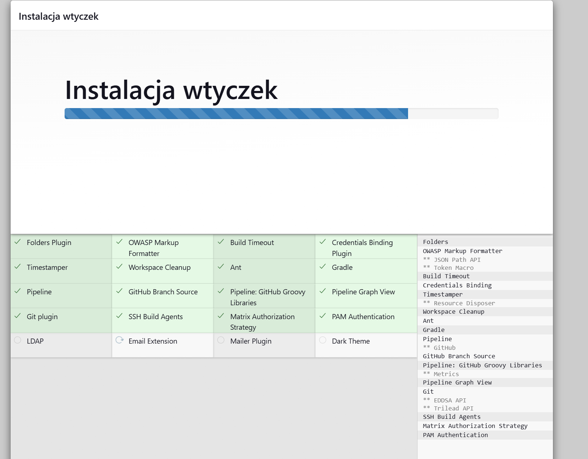

## Pipeline, Jenkins, izolacja etapów

### Przygotowanie
Utwórz instancję Jenkins
* Upewnij się, że na pewno działają kontenery budujące i testujące, stworzone na poprzednich zajęciach
* Zapoznaj się z instrukcją instalacji Jenkinsa: https://www.jenkins.io/doc/book/installing/docker/
  * Uruchom obraz Dockera który eksponuje środowisko zagnieżdżone
  * Przygotuj obraz blueocean na podstawie obrazu Jenkinsa (czym się różnią?)
  * Uruchom Blueocean
  * Zaloguj się i skonfiguruj Jenkins
  * Zadbaj o archiwizację i zabezpieczenie logów

Czynności wykonywane zgodnie z instrukcją instalacji [Jenkinsa](https://www.jenkins.io/doc/book/installing/docker/):


Utworzenie sieci mostkowej w dockerze


Uruchomienie obrazu `docker:dind` mające na celu pozwolenie nam wykonywania komend wewnątrz Jenkinsa


Dostosowanie oficjalnego obrazu Jenkinsa poprzez utworzenie customowego pliku `Dockerfile.jenk`


Zbudowanie przygotowanego przed chwilą obrazu


Uruchomienie kontenera z obrazem `myjenkins-blueocean:2.492.3-1`


Dzięki poniższej komendzie możemy uzyskać dostęp do logów utworzonego kontenera `jenkins-blueocean`, co jest dla nas konieczne, żebyśmy mogli odblokować Jenkinsa:
```
docker logs jenkins-blueocean
```

Istotnym jest również przekierowanie portu `8080` w Visual Studio Code, jest to konieczne inaczej nie będziemy nawet mogli dostać się do Jenkinsa. 
Pierwszym problemem przy uruchomieniu Jenkinsa był właśnie brak przekierowania portu, wyświetlał się wtedy błąd o odrzucenia połączenia przez localhosta.

  
### Zadanie wstępne: uruchomienie
Zadanie do wykonania na ćwiczeniach
* Konfiguracja wstępna i pierwsze uruchomienie
  * Utwórz projekt, który wyświetla `uname`
  * Utwórz projekt, który zwraca błąd, gdy... godzina jest nieparzysta
  * Pobierz w projekcie obraz kontenera `ubuntu` (stosując `docker pull`)

Wydobyte wcześniej z logów kontenera `jenkins-blueocean` hasło jest nam potrzebne aby dostać się do Jenkinsa i rozpocząć instalację:



Instalacja Jenkinsa


Projekt wypisujący `uname`, sprawdza czy godzina jest parzysta oraz pobiera obraz kontenera `ubuntu`.


### Zadanie wstępne: obiekt typu pipeline
Ciąg dalszy sprawozdania - zadanie do wykonania po wykazaniu działania Jenkinsa
* Utwórz nowy obiekt typu `pipeline`
* Wpisz treść *pipeline'u* bezpośrednio do obiektu (nie z SCM - jeszcze!)
  * https://www.jenkins.io/doc/book/pipeline/syntax/
  * https://www.jenkins.io/doc/pipeline/steps/git/
  * https://www.jenkins.io/doc/pipeline/examples/#unstash-different-dir
  * [https://www.jenkins.io/doc/book/pipeline/docker/](https://www.jenkins.io/doc/book/pipeline/docker/#building-containers)
* Spróbuj sklonować repo przedmiotowe (`MDO2025_INO`)
* Zrób *checkout* do swojego pliku Dockerfile (na osobistej gałęzi) właściwego dla *buildera* wybranego w poprzednim sprawozdaniu programu
* Zbuduj Dockerfile
* Uruchom stworzony *pipeline* drugi raz

Do wcześniejszego sprawozdania wybrałem bibliotekę [Simple Dynamic Strings - sds](https://github.com/antirez/sds), jednak po skonsultowaniu się w trakcie zajęć okazała się ona niewystarczająca do obecnego sprawozdania. Dlatego w ramach zastępstwa zmienił program, na którym bazuje to sprawozdanie na [Redis](https://github.com/redis/redis).


Skrypt projektu pipeline, który klonuje repozytorium przedmiotowe. Następnie buduje obraz wybranego programu i na podstawie nowopowstałego obrazu `redis-builder` tworzy drugi obraz `redis-test`, który jest uruchamiany i podczas swojego działania wykonuje testy działania programu.


Log konsoli pokazujący, że skrypt zakończył się sukcesem

 
### Opis celu
Dla osób z wybranym projektem
* Opracuj dokument z diagramami UML, opisującymi proces CI. Opisz:
  * Wymagania wstępne środowiska
  * Diagram aktywności, pokazujący kolejne etapy (collect, build, test, report)
  * Diagram wdrożeniowy, opisujący relacje między składnikami, zasobami i artefaktami
* Diagram będzie naszym wzrocem do porównania w przyszłości
### Pipeline: składnia
Zadanie do wykonania, jeżeli poprawnie działa obiekt *pipeline* i udało się odnaleźć dostęp do plików Dockerfile
* Definiuj pipeline korzystający z kontenerów celem realizacji kroków `build -> test`
* Może, ale nie musi, budować się na dedykowanym DIND, ale może się to dziać od razu na kontenerze CI. Należy udokumentować funkcjonalną różnicę między niniejszymi podejściami
* Docelowo, `Jenkinsfile` definiujący *pipeline* powinien być umieszczony w repozytorium. Optymalnie: w *sforkowanym* repozytorium wybranego oprogramowania


### Kompletny pipeline: wymagane składniki
Kompletny *pipeline* (wprowadzenie) - do wykonania po ustaleniu kształu kroków `deploy` i `publish`
*  Kontener Jenkins i DIND skonfigurowany według instrukcji dostawcy oprogramowania
*  Pliki `Dockerfile` wdrażające instancję Jenkinsa załączone w repozytorium przedmiotowym pod ścieżką i na gałęzi według opisu z poleceń README
*  Zdefiniowany wewnątrz Jenkinsa obiekt projektowy *pipeline*, realizujący następujące kroki:
  

Podgląd konfiguracji SCM dla pipeline'u


Całościowy plik Jenkinsfile zawierający finalną strukturę pipeline'u.  


  * Kontener `Builder`, który powinien bazować na obrazie zawierającym dependencje (`Dependencies`), o ile stworzenie takiego kontenera miało uzasadnienie. Obrazem tym może być np. baza pobrana z Docker Hub (jak obraz node lub 
dotnet) lub obraz stworzony samodzielnie i zarejestrowany/widoczny w DIND (jak np. obraz oparty o Fedorę, doinstalowujący niezbędne zależności, nazwany Dependencies). Jeżeli, jak często w przypadku Node, nie ma różnicy między runtimowym obrazem a obrazem z dependencjami, proszę budować się w oparciu nie o latest, ale o **świadomie wybrany tag z konkretną wersją**


Przedstawiony plik `Dockerfile` jest podstawą do stworzenia obrazu `redis-builder`, obraz ten klonuje repozytorium programu `redis` oraz zawiera wszelkie potrzebne zależności. W celu pominięcia zapytań do użytkownika instalującego (któego chcemy pominąć poprzez zautomatyzowanie dystrybucji) została dodana klauzula `ENV DEBIAN_FRONTEND=noninteractive`. Dodatkowo komenda `rm -rf` usuwa pamięć podręczną (cache).

  * Obraz testujący, w ramach kontenera `Tester`
    * budowany przy użyciu ww. kontenera kod, wykorzystujący w tym celu testy obecne w repozytorium programu
    * Zadbaj o dostępność logów i możliwość wnioskowania jakie testy nie przechodzą


Plik `Dockerfile.test` pozwala utworzyć obraz `redis-test`, który później jest bazą dla kontenera testującego. Wykonuje on obecnie tylko jeden z testów (test jednostkowy `info.tcl`), przyjąłem takie rozwiązanie ze względu na powtarzające się losowe problemy z wykonywaniem się testów. Problemy dotyczyły za każdym razem innego testu i nie było konkretnej przyczyny do takiego zachowania się testów. Jeśli pojawił się test, który "nie przechodził" cały proces pipeline'u był przerywany, pomimo faktu że program powinien działać, ponieważ żaden z testów sprawiających problemy nie zagrażał działaniu programu.

  * `Deploy`
    *  Krok uruchamiający aplikację na kontenerze docelowym
    *  Jeżeli kontener buildowy i docelowy **wydają się być te same** - być może warto zacząć od kroku `Publish` poniżej
    *  Jeżeli to kontener buildowy ma być wdrażany - czy na pewno nie trzeba go przypadkiem posprzątać?
    *  Przeprowadź dyskusję dotyczącą tego, jak powinno wyglądać wdrożenie docelowe wybranej aplikacji. Odpowiedz (z uzasadnieniem i dowodem) na następujące kwestie:
        * czy program powinien zostać *„zapakowany”* do jakiegoś przenośnego pliku-formatu (DEB/RPM/TAR/JAR/ZIP/NUPKG)
        * czy program powinien być dystrybuowany jako obraz Docker? Jeżeli tak – czy powinien zawierać zawartość sklonowanego repozytorium, logi i artefakty z *builda*?
        * Przypomnienie: czym się różni (i jakie ma zastosowanie) obraz `node` od `node-slim`
    *  Proszę opisać szczegółowo proces który zostanie opisany jako `Deploy`, ze względu na mnogość podejść


  * `Publish`
    * Przygotowanie wersjonowanego artefaktu, na przykład:
      * Instalator
      * NuGet/Maven/NPM/JAR
      * ZIP ze zbudowanym runtimem
    * Opracuj odpowiednią postać redystrybucyjną swojego artefaktu i/lub obrazu (przygotuj instalator i/lub pakiet, ewentualnie odpowiednio uporządkowany obraz kontenera Docker)
      * Musi powstać co najmniej jeden z tych elementów
      * Jeżeli ma powstać artefakt, dodaj go jako pobieralny obiekt do rezultatów „przejścia” *pipeline’u* Jenkins (https://www.jenkins.io/doc/pipeline/steps/core/).
    * Opcjonalnie, krok `Publish` (w przypadku podania parametru) może dokonywać promocji artefaktu na zewnętrzne *registry*


Pomyślne uruchomienie pipeline'u


Kilka udanych wersji pipeline'u na dockerhubie dowodzi, że nie jest to jednorazowy sukces.


Pobranie obrazu i uruchomienie na jego podstawie kontenera zawierającego w sobie program Redis. 

