# Sprawozdanie nr 1

**Rafał Malik**  
**ITE gr.05**  
**415448**

---

## Laboratorium nr 1

### 1. Instalacja Gita i obsługa kluczy SSH

```bash
sudo dnf install git
sudo dnf install openssh-clients 
sudo dnf install openssh-server
```

Sprawdzamy wersję zainstalowanego oprogramowania:

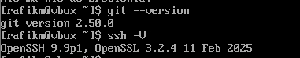

---

### 2. Klonowanie repozytorium przedmiotowego

```bash
git clone https://github.com/InzynieriaOprogramowaniaAGH/MDO2025_INO.git
```

Następnie tworzymy klucze SSH i ustawiamy nasze dane logowania:

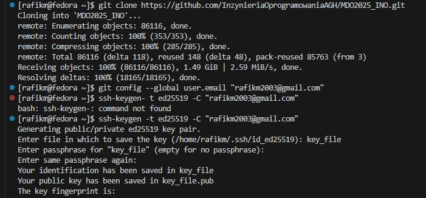  
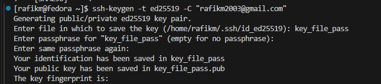

Tworzą się dwa klucze (jeden z hasłem). Ich zawartość kopiujemy i dodajemy do profilu na GitHubie:

```bash
cat key_file.pub
cat key_file_pass.pub
```

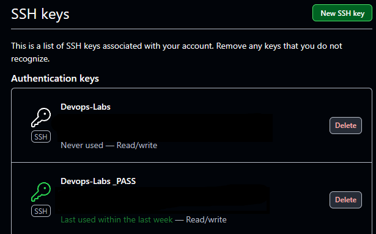

---

### 3. Klonowanie repozytorium za pomocą klucza SSH

```bash
git clone git@github.com:InzynieriaOprogramowaniaAGH/MDO2025_INO.git
```

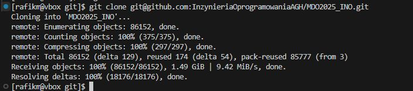

---

### 4–5. Tworzenie gałęzi i folderu z numerem indeksu

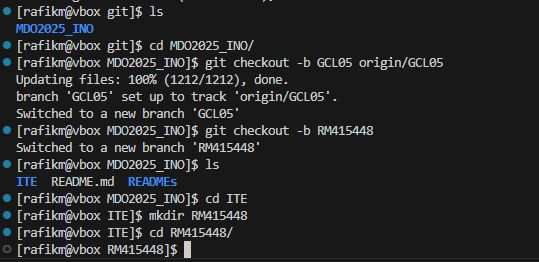

---

### 6. Tworzenie Git hooka

Ponieważ jesteśmy połączeni przez **VSCode Remote SSH**, możemy łatwo edytować pliki i stworzyć hooka `commit-msg`.

```bash
code commit-msg
```

Tworzymy plik, testujemy jego działanie, a następnie przenosimy go do `.git/hooks`:

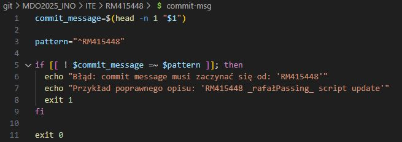  
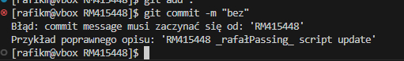  
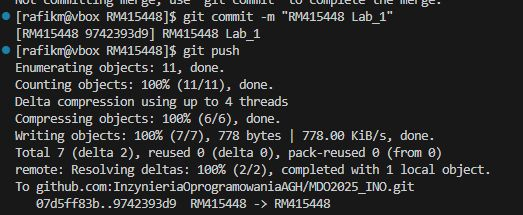

---

### 7. Ustawienie 2FA na GitHubie

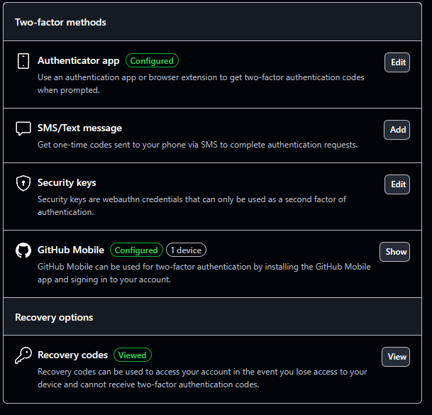

---

## Laboratorium nr 2

### 1–3. Instalacja Dockera i pobranie obrazów

```bash
sudo dnf install docker
```

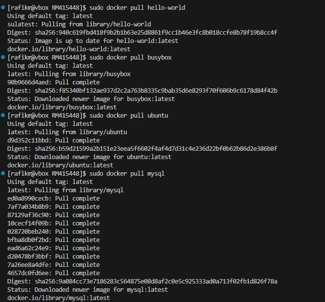

---

### 4. Uruchomienie kontenerów `busybox` i `ubuntu`

```bash
sudo docker run -it busybox
sudo docker run -it --name ubuntu-container ubuntu bash
```

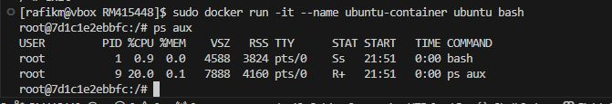

---

### 5. Aktualizacja i zamykanie kontenerów

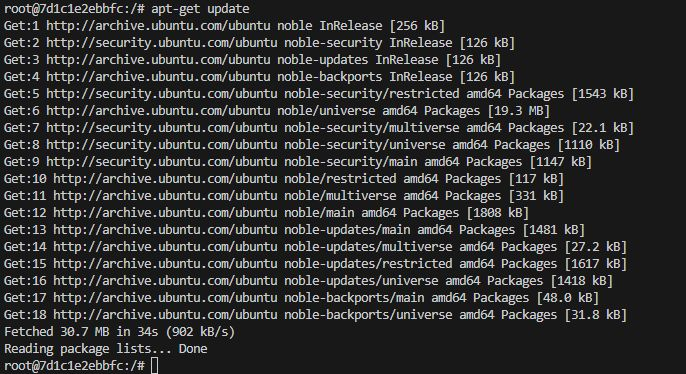

---

### 6. Tworzenie Dockerfile

Celem pliku jest instalacja Gita, aktualizacja systemu i klonowanie repozytorium (próba przez SSH nie powiodła się).

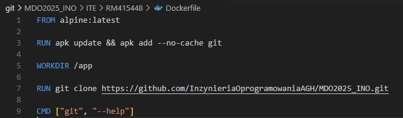  
Dockerfile w trakcie budowy:  
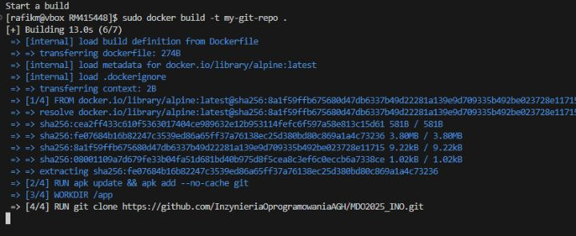  
Po zakończeniu budowy:  
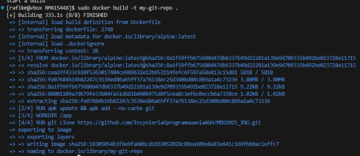

Sprawdzamy, czy Git istnieje i czy repozytorium zostało sklonowane:

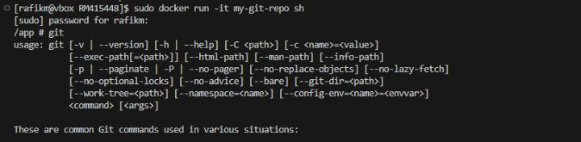  
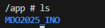

---

### 7. Usuwanie kontenerów i obrazów

Sprawdzamy aktywne kontenery i je usuwamy:

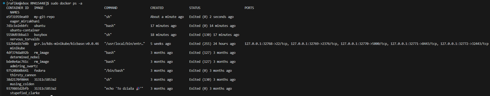  
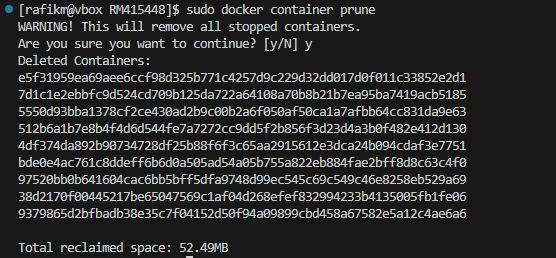

To samo z obrazami:

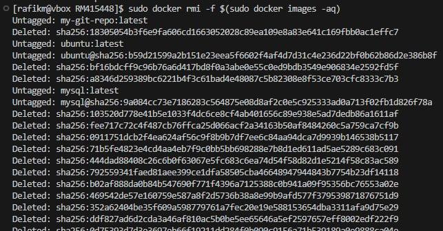

---

## Laboratorium nr 3

### 1. Budowanie i testowanie aplikacji Node.js

Klonujemy repozytorium:

```bash
git clone https://github.com/devenes/node-js-dummy-test.git
```

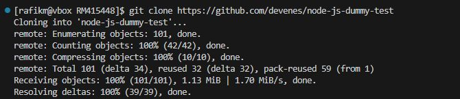

Instalujemy `npm` (również niezbędne przy pracy z kontenerami):

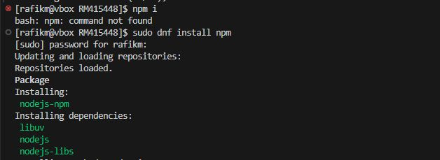

Instalujemy zależności:

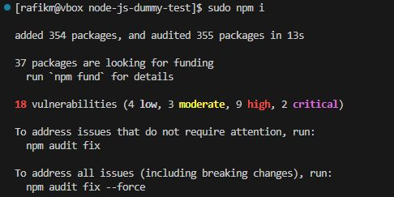

Uruchamiamy testy:

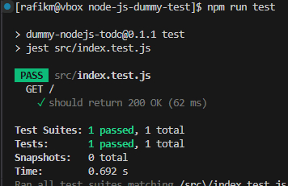

W kontenerze również pamiętamy o `npm`, klonujemy repozytorium i odpalamy testy:

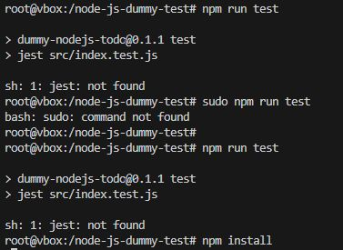  
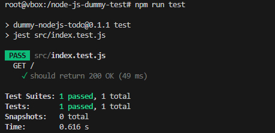

---

### 2. Tworzenie Dockerfile

Plik `Dockerfile.build` odpowiada za:
- klonowanie repozytorium,
- instalację zależności za pomocą `npm`.

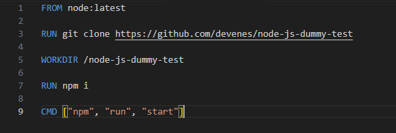
