# Sprawozdanie 1  -  Meg Paskowski IO gr. 2

## Zajęcia 1 (03.03.2025r.)

### 1. Przygotowanie maszyny wirtualnej  
Zadania wykonuję za pomocą maszyny Oracle VirtualBox.

Dokonane ustawienia:
- 4GB pamięci RAM
- 36 GB miejsca na dysku (całość przydzielona od razu)
- 2 CPU
- Przekierowanie Portów (port forwarding) dla SSH na NAT. 
Pozwala na komunikację między zewnętrzną siecią a maszyną wirtualną poprzez odpowiednie przekierowanie ruchu na określony port.  
W tym przypadku port 2222 jest przekierowywany na maszynę wirtualną, umożliwiając połączenie SSH z systemem Fedora działającym wewnątrz maszyny wirtualnej.

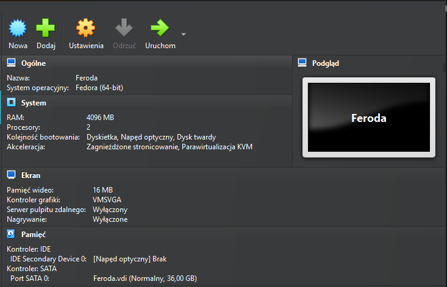

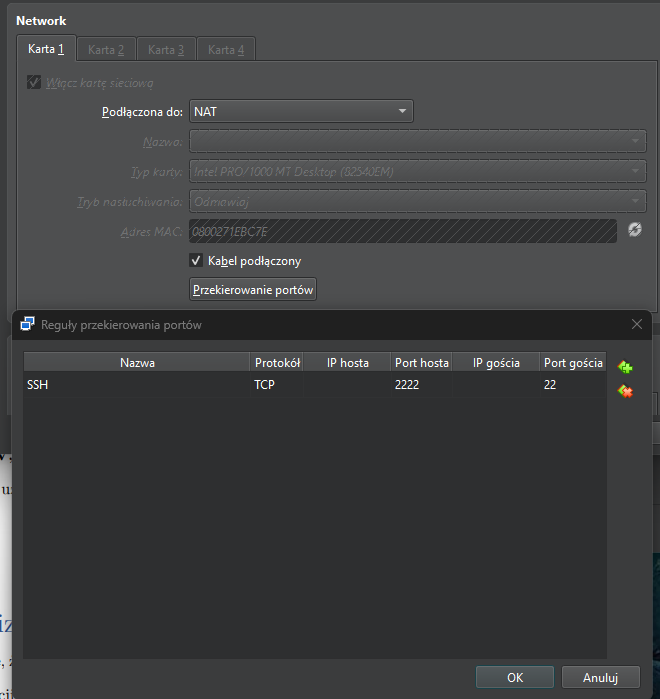

Po ustawieniu tych opcji przechodzę do instalacji Fedory.  
Ustawiam nazwę użytkownika, hasło oraz przydział dysku.

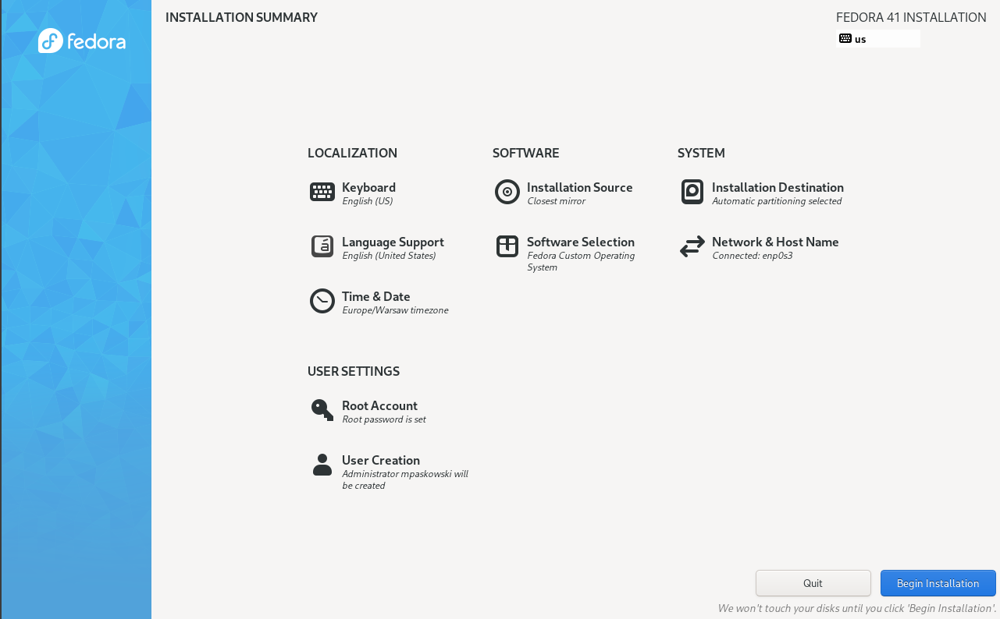

### 2. Logowanie się przez SSH do maszyny wirtualnej  
Aby zalogować się poprzez SSH (Secure Shell) do zainstalowanej maszyny wirtualnej, należy w terminalu systemu Windows użyć następującej komendy oraz podać hasło.

```bash
ssh -p 2222 mpaskowski@127.0.0.1
```

Gdzie:
- **ssh** ~> polecenie używane do nawiązywania połączenia z serwerem przy użyciu protokołu SSH
- **-p 2222** ~> Flaga -p oznacza, że używam niestandardowego portu do połączenia. Domyślnie SSH używa portu 22, ale w tym przypadku używam portu 2222.
- **mpaskowski** ~> moja nazwa użytkownika systemu Fedora
- **127.0.0.1** ~> adres IP lokalny, ponieważ łączymy się z serwerem, który działa na tym samym komputerze.

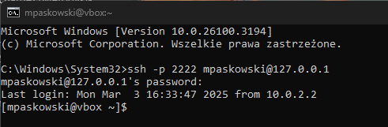

Przed wykonaniem powyższej komendy można sprawdzić status SSH za pomocą:

```bash
systemctl status sshd
```
w systemie Linux.

### 3. Wysyłanie i odbieranie plików za pomocą SSH  
Aby wysłać i odebrać plik poprzez użycie SSH z/do maszyny wirtualnej:

* Z serwera Fedory do systemu Windows:
    ```bash
    scp -P 2222 mpaskowski@127.0.0.1:/home/mpaskowski/test2.txt "C:\Users\Meg Paskowski\Desktop\test2.txt"
    ```

    Stworzyłam plik "test2.txt" na systemie Windows.

    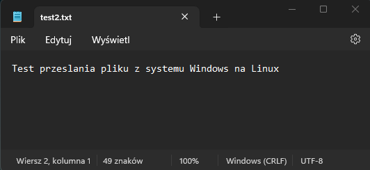

    Następnie wpisałam do terminala (Windows) powyższe polecenie oraz hasło, o które zostałam poproszona do konta na Fedorze.

    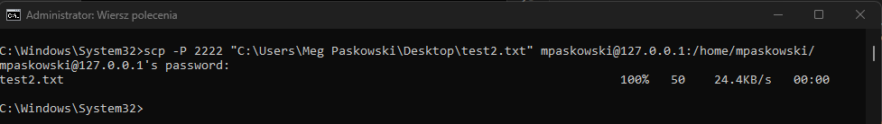

    W celu sprawdzenia, czy mam plik na serwerze, wpisałam w terminal polecenie:

    ```bash
    ls
    ```

    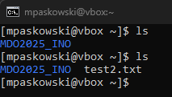

* Z Windows'a do serwera Fedory:
    ```bash
    scp -P 2222 "C:\Users\Meg Paskowski\Desktop\test4.txt" mpaskowski@127.0.0.1:/home/mpaskowski/
    ```
    Stworzyłam plik testowy "test4.txt" przy użyciu:

    ```bash
    echo "Plik testowy przesyłania pliku z serwera Fedora" > test4.txt
    ```

    na Linuxie.

    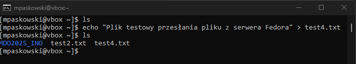
    
    Następnie użyłam powyższej komendy w celu przesłania pliku, wpisałam hasło. 

    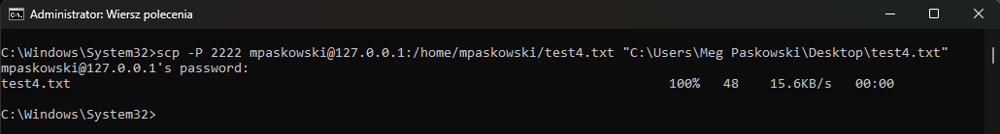
    Plik pojawił się we skazanym miejscu.


### 4. Klonowanie repozytoriów GitHub przez SSH  
Na samym początku zainstalowałam Gita na Linuxie: `sudo dnf install git`.
Następnie konfiguruje klucz SSH. 
Utworzyłam folder `mkdir -p ~/.ssh`.
Oraz utworzyłam klucz SSH `ssh-keygen -t rsa -b 4096 -C "your_email@example.com"`
Aby sprawdzić, czy klucz został utworzony użyłam polecenia `ls -al ~/.ssh`.
Oraz skopiowałam klucz publiczny `cat ~/.ssh/id_rsa.pub`.

Do sklonowania dowolnego repozytorium GitHub poprzez SSH wewnątrz maszyny wirtualnej, użyłam komendy `git clone`.
Przygotowałam testowe repozytorium o nazwie "Metodyki-DevOps", które następnie sklonowałam przy użyciu:

```bash
git clone git@github.com:icharne2/Metodyki-DevOps.git
```

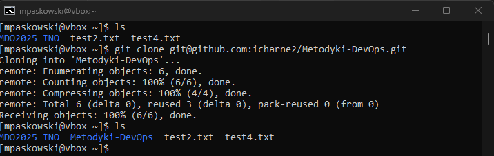

Aby sprawdzić, czy repozytorium się skopiowało, ponownie użyłam `ls`. Następnie dodałam plik "test3.txt" do folderu "Metodyki-DevOps".

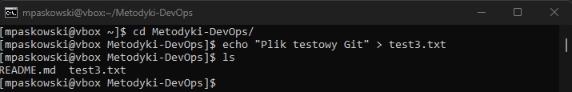

Dodałam zmiany do obszaru roboczego Gita (staging area) za pomocą `git add`.  
Sprawdziłam status za pomocą `git status`.  
Zatwierdziłam zmiany za pomocą `git commit -m "Test3"`.  
Oraz wysłałam do Gita używając `git push origin main`.

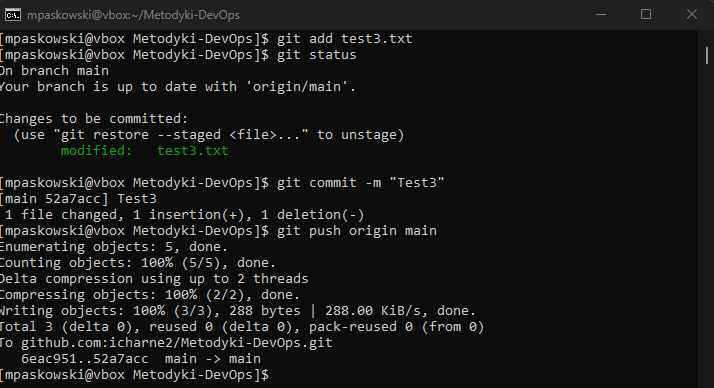

W celu sprawdzenia gałęzi Gita można użyć komendy:
```bash
git branch
```
Po wejściu na swoje repozytorium na GitHubie mogę zauważyć dodany plik.

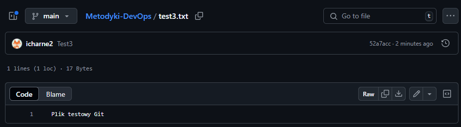

### 5. Połączenie z systemem plików za pomocą FileZilla  
Aby połączyć się z systemem plików za pomocą programu FileZilla, wykonuję następujące kroki:
- Instaluję program FileZilla z oficjalnej strony [FileZilla Download](https://filezilla-project.org/download.php?platform=win64) na systemie Windows.
- Po otwarciu aplikacji wybieram: **Plik -> Menedżer Stron**
- Wybieram "Nowy adres" oraz wpisuję IP serwera (127.0.0.1), Port (2222), użytkownika (mpaskowski) oraz hasło. Wybieram również protokół **SFTP - SSH File Transfer Protocol**.

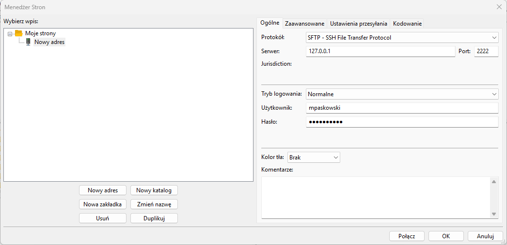

- Zatwierdzam poprzez opcję "Połącz".  
  Poprawne połączenie jest potwierdzone komunikatem w ramce na górze programu.

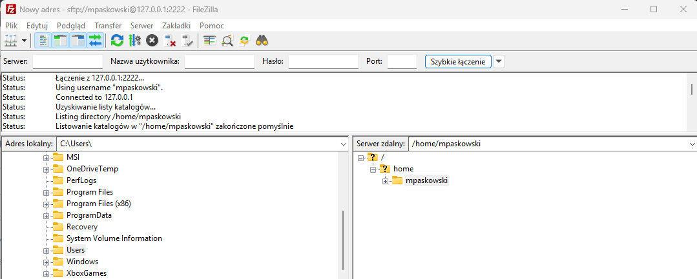

Aby sprawdzić, czy przesył pliku działa, utworzyłam w systemie Windows plik "text.txt".

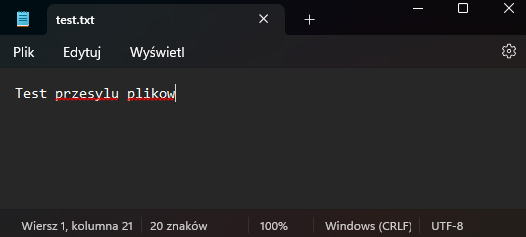

Oraz dodałam go do katalogu "/home/mpaskowski" poprzez przeciągnięcie pliku z pulpitu Windows do folderu znajdującego się w podglądzie programu FileZilla.


Potwierdzenie poprawnego przesyłu można zobaczyć ponownie we wspomnianej wcześniej ramce, jak i po użyciu polecenia `ls` na systemie Linux.

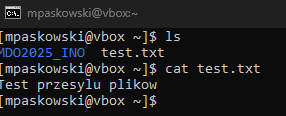

### 6. Połączenie z Visual Studio Code przez Remote SSH  
Połączenie środowiska Visual Studio Code za pomocą wtyczki Remote SSH.  
Na samym początku dokonałam instalacji wtyczki **Remote SSH**.  


Następnie w zakładce **Remote Explorer**, po kliknięciu prawym przyciskiem myszy na zakładkę "SSH" i wybraniu opcji **New Remote**, wpisałam adres `ssh -p 2222 mpaskowski@127.0.0.1` oraz hasło, aby uzyskać połączenie. Następnie zainstalowałam `tar` na maszynie wirtualnej, które jest potrzebne podczas połączenia SSH ponieważ VC Code próbuje zainstalować VS Code Server. Stąd potrzeba rozpakoania plików za pomocą `tar`.

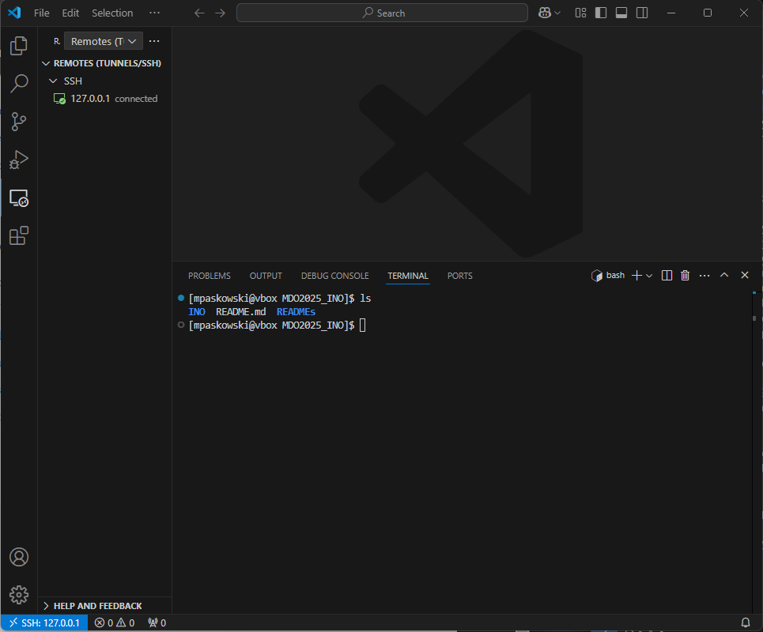


### 7. Sklonowanie repozytorium przedmiotowego za pomocą HTTPS i personal access token
Aby sklonować repozytorium za pomocą HTTPS utworzyłam na GitHubie Personal Acess Token (Settings -> Developer settings -> Personal access tokens -> Generate new token). Nastpępnie wykonałam komende `git clone https://github.com/InzynieriaOprogramowaniaAGH/MDO2025_INO.git`.

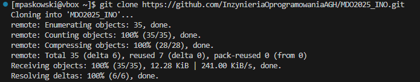

### 8. Tworzenie nowej gałęzi w repozytorium przedmiotowym.
Po sklonowaniu repozytorium przeszłam do katalogu repozytorium. 
```bash
cd MDO2025_INO
```

Następnie na gałąź `main` oraz swojej grupy `GCL02`.
```bash
git checkout main

git checkout GCL02
```

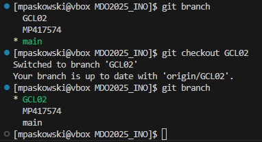

Utworzyłam gałąź o nazwie `MP417574`.
```bash
git checkout -b MP417574
```

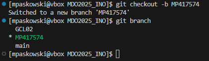

Dodałam nowy katalog `MP417574`.

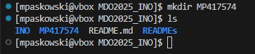

### 9. Tworzenie Git hooka
Napisałam skrypt weryfikujący, że każdy "commit message", tak aby zaczynał się od `MP417574`. 
Skryp został dodany do stworzonego wczesniej katalogu oraz do `.git/hooks/`.

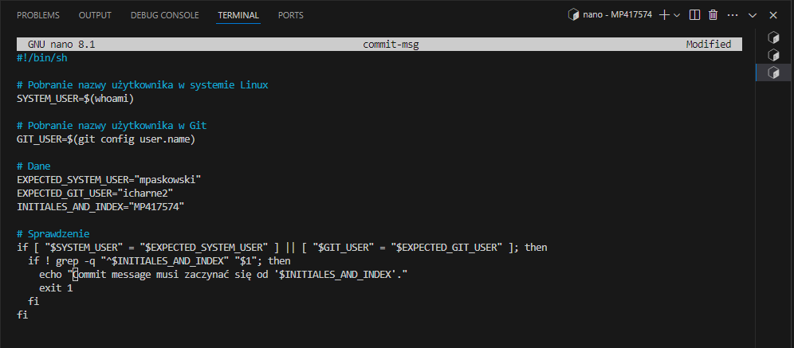

Wykonałam testowe commity.


Na sam koniec dodałam swoją gałąź na GitHub.

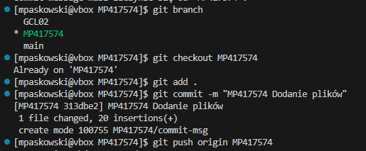

## Zajęcia 2 (10.03.2025r.)

### 1. Instalacja Docker'a w systemie linuksowym
Aby zainstalować Docera na Fedorze:
```bash
#Instalacja
sudo dnf install -y docker-ce docker-ce-cli containerd.io docker-buildx-plugin docker-compose-plugin
```
Gdzie:
- `docker-ce` -> Główna wersja Dockera (Community Edition)
- `docker-ce-cli` -> CLI (interfejs wiersza poleceń) Dockera, który pozwala na zarządzanie kontenerami i obrazami Docker z poziomu terminala.
- `containerd.io` -> Containerd to rdzeń systemu kontenerów, który Docker wykorzystuje do zarządzania kontenerami.
- `docker-buildx-plugin` ->  Plugin do Dockera, który rozszerza możliwości budowania obrazów Docker.
- `docker-compose-plugin` ->  Plugin do Dockera, który umożliwia korzystanie z Docker Compose w formie pluginu wbudowanego w Dockera. Docker Compose służy do definiowania i uruchamiania aplikacji składających się z wielu kontenerów. Umożliwia łatwe zarządzanie wieloma kontenerami.

Uruchomiłam Docera tak aby działał:

```bash
sudo systemctl start docker #uruchamia usługę Docker w systemie
sudo systemctl enable docker #włącza automatyczne uruchamianie Dockera przy starcie systemu
```

### 3. Pobranie obrazów `hello-world`, `busybox`, `ubuntu`, `fedora`, `mysql`.
Aby pobrać obrazy:
```bash
sudo docker pull IMAGE_NAME 
```

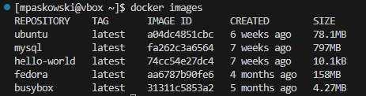


### 4. Uruchomienie kontenera z obrazu `busybox`
Do uruchomienia kontenera `busybox`:
```bash
docker run --rm --tty --interactive busybox
```

Gdzie:
- `--rm` -> Usuwa kontener po zakończeniu pracy
- `--tty` -> Tworzy terminal (umożliwia interakcję).
- `--interactive` -> Umożliwia interaktywną pracę. Można inaczej zapisac jako `-i`.

Teraz w systemie pracuje kontener oprary na obrazie `busybox`.

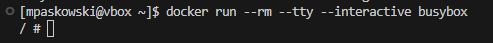

Aby prawdzić numer wersji BusyBox:
```bash
busybox | head -n 1
```

Aby wyjść z kontenera wpisujemy `exit`.

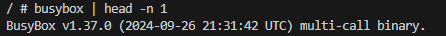

### 5. Uruchomienie "system w kontenerze" (kontener obrazu `fedora` / `ububtu`)
Uruchomiłam ubuntu jako "system w kontenerze". Wymaga on uruchomienia interaktywnego.
Nstępnie sprawdziłam procesy w kontenerze.
PID 1 w kontenerze to `/bin/bash`, co oznacza, że kontener działa w trybie interaktywnym, a głównym procesem jest powłoka bash.

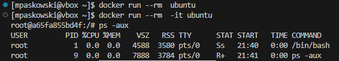

Zaktualizowałam pakiety za pomocą:
```bash
apt update && apt upgrade -y
```

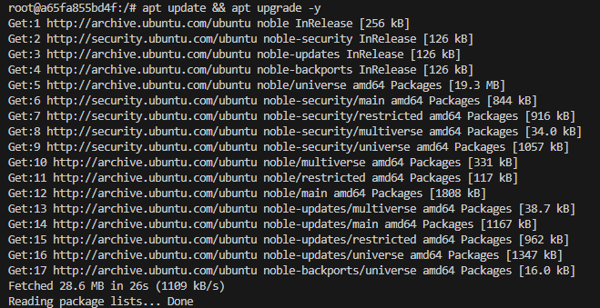

Dla Fedory procedura była taka sama, ale z użyciem dnf zamiast apt.

```bash
docker run -it fedora bash
dnf update -y
```

### 6. Stworzenie pliku `Dockerfile`.
Do utworzenie pliku `Dockerfile`
```bash
nano Dockerfile

FROM ubuntu:latest #używa najnowszego obrazu Ubuntu jako bazy
RUN apt update && apt install -y git
WORKDIR /app #ustawia katalog roboczy na /app
RUN git clone https://github.com/InzynieriaOprogramowaniaAGH/MDO2025_INO.git # polecenie klonuje repozytorium
CMD ["/bin/bash"] #umożliwia interaktywną pracę po uruchomieniu kontenera
```

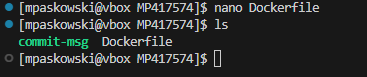

Następnie zbudowałam obraz Dockera oraz go uruchomiłam.
```bash
docker build -t moj_git_container .

docker run -it moj_git_container bash
```
Na sam koniec zwerifikowałam, czy repozytorium zostało sklonowane.
```bash
ls /app/MDO2025_INO
```

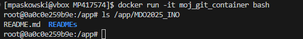


### 7. Czyszczenie kontenerów i obrazów
```bash
#Aby zatrzymać wszytkie działające kontenery:
docker stop $(docker ps -aq)

#Usunąć wszytkie kontenery
docker rm $(docker ps -aq)

#Usunięcie wszystkich obrazów Dockera
docker rmi $(docker images -q)

```
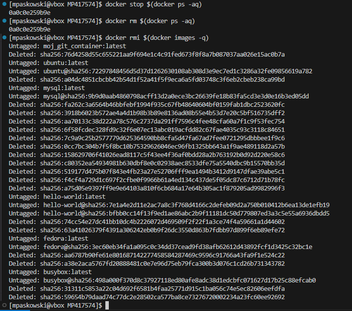

## Zajęcia 3 (17.03.2025r.)
Przeprowadzam budowanie `irssi`.
```bash
git clone https://github.com/irssi/irssi
cd irssi
meson Build
ninja -C Build 
```

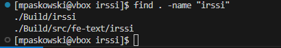

Przeprowadzam budowanie `irssi`. w kontenerze `fedora`.
```bash
docker run --rm -it fedora bash
./irssi/Build/src/fe-text/irssi

#Instalacja gita
dnf install -y git

#Pobranie repozytorium
git clone https://github.com/irssi/irssi
cd irssi

#Instalacja odpowiednich rzeczy
dnf install -y meson
dnf install -y gcc
dnf install -y glib2-devel
dnf install -y ninja-build
dnf install -y openssl
dnf install -y utf8proc
dnf install -y ncurses-devel
dnf install -y perl perl-ExtUtils-Embed

#Zapis jako jedno polecenie
dnf install -y meson gcc glib2-devel ninja-build openssl utf8proc ncurses-devel perl perl-ExtUtils-Embed

#Budowanie
meson Build
ninja -C Build
```

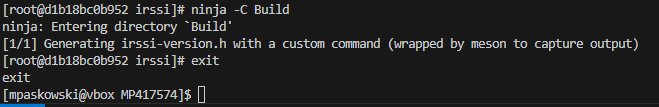

Aby wykonać testy należy przejść do katalogu `/Build`

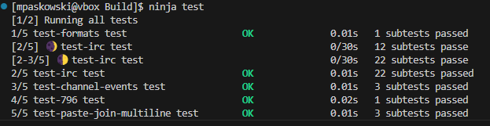

Tworzenie pliku `Dockerfile` opisującego w jaki sposób budować takie kontenery jak powyżej.

```bash
#Utworzenie pliku
nano Dockerfile.lab3

#W PLIKU
FROM fedora:latest

# Instalacja pakietów
RUN dnf install -y git meson gcc glib2-devel ninja-build openssl utf8proc ncurses-devel perl perl-ExtUtils-Embed

# Klonowanie i budowa
RUN git clone https://github.com/irssi/irssi
WORKDIR /irssi
RUN meson Build
RUN ninja -C Build
```

Aby sprawdzić, czy kontener poprawnie sie zbuduje 
```bash
docker build -t irssibld -f ./Dockerfile.lab3 .

docker imagines
```
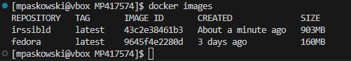

Tworze następny plik `Dockerfile` z testami:

```bash
FROM irsiibld
WORKDIR /irssi/Build
RUN ninja test
```
Odpalam testy:

```bash
docker build -t irssibld -f ./Dockerfile.lab3 .

docker images
```

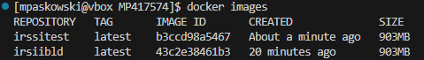

Powtarzam kroki tylko dla `node-js-dummy-test`

```bash
sudo dnf install -y nodejs

git clone https://github.com/devenes/node-js-dummy-test
cd node-js-dummy-test
npm install
npm test`#Uruchomienie zdefiniowanych testow
```

Tworzenie `Dockerfile`:

```bash
FROM node

RUN dnf -y install npm node git
RUN git clone https://github.com/devenes/node-js-dummy-test
WORKDIR /node-js-dummy-test
RUN npm install
```

Sprawdzenie:

```bash
docker build -t nodebld -f ./Dockerfile.lab3.node-js .
```

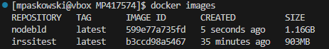

`Dockerfile` z testami:

```bash
#W pliku Dockerfile
FROM nodebld
RUN npm test
```

Uruchamianie:

```bash
docker build -t nodebld -f ./Dockerfile.lab3.node-js.test .
```

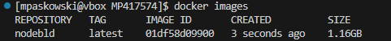

Podsumowanie:
- Irssi używa Meson + Ninja, a Node.js aplikacja używa npm.
- Obraz Docker to statyczny szablon zawierający system, zależności i aplikację, który służy do tworzenia kontenerów.
- Kontener to działający proces utworzony z obrazu, który wykonuje określone zadania (np. build, testy).
- W kontenerze pracują procesy odpowiedzialne za kompilację i testowanie aplikacji (1. meson Build, ninja -C Build, npm install 2. ninja test, npm test).

## Zajęcia 4 (24.03.2025r.)
### Zachowywanie stanu
Przygotowałam woluminy wejściowy i wyjściowy.

```bash
docker volume create input_volume
docker volume create output_volume
```
Sprawdziłam utworzone woluminy `docker volume ls`

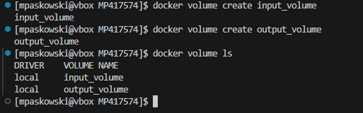

Uruchomiono nowy kontener bazujący na ubuntu połączono do niego utworzone woluminy poleceniem 
```bash
docker run -it --name volume-test \
  -v input_volume:/mnt/input \
  -v output_volume:/mnt/output \
  ubuntu:latest /bin/bash
```

Weryfikacja obecności zmontowanych katalogów za pomocą `ls`.

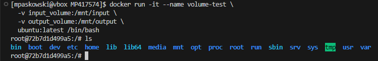

Na hoście odnalazłam lokalizacje woluminu wejściowego:
```bash
docker volume inspect input_volume
```
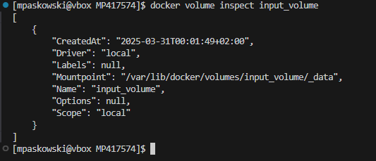

i skolonowałam repozytorium cJSON, na hoście (przed uruchomieniem kontenera).

```bash
sudo git clone https://github.com/DaveGamble/cJSON.git /var/lib/docker/volumes/input_volume/_data
```

Przeprowadziłam werifikacje w kontenerze:

```bash
ls /mnt/input
```

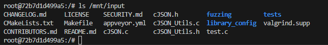

Poleceniem `cp -r` skopiowano repozytorium do katalogu wewnętrznego kontenera oraz zbudowano poleceniem `make`.

```bash
cp -r /mnt/input /tmp/cjson
cd /tmp/cjson
# Kompilacja projektu
make

#W celu sprawdzenia wygenerowanych plków
ls
```

Skompilowanie pliki bibliotek i nagłówkowe skopiowano do katalogu wyjściowego.

```bash
#Utworzenie katalogu wyjściowego
mkdir -p /mnt/output/build

#Kopiowanie tylko niezbędnych plików wynikowych
cp libcjson.a libcjson.so* libcjson_utils.a libcjson_utils.so* cJSON.h /mnt/output/build/

#Sprawdzenie katalogu wyjściowego 
ls -l /mnt/output/build/
```

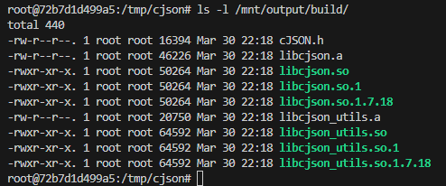

Weryfikacja na hoście:

```bash
sudo ls -l /var/lib/docker/volumes/output_volume/_data/build
```

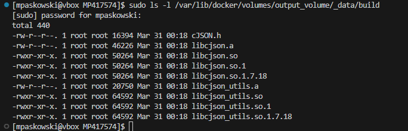


To podejście narusza izolację Dockera, wprowadza trudności z przenośnością, bezpieczeństwem i uprawnieniami, a także utrudnia automatyzację. Zamiast tego, bardziej efektywne jest użycie dedykowanego kontenera, który montuje wolumin i wykonuje `git clone` w sposób bezpieczny i przewidywalny.

Ponowiłam operację, ale za komocą klonowania na wolumin wejściowy przeprowadziłam klonowanie wewnątrz kontenera (za pomocą gita w kontenerze).

```bash
apt-get update && apt-get install -y git

git clone https://github.com/DaveGamble/cJSON.git /mnt/input/cJSON/

ls /mnt/input/cJSON/
```

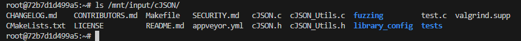


Po wyjściu z kontenera:
```bash
docker volume inspect input_volume

sudo ls /var/lib/docker/volumes/input_volume/_data
```

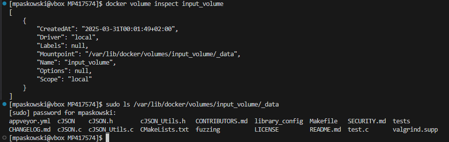

Dlaczego warto użyć pliku `Dockerfile`?
- Eliminuje ręczne kroki (instalacja zależności, klonowanie, kompilacja).
-  Gwarantuje identyczne środowisko budowania za każdym razem.
- Unika problemów z uprawnieniami i bezpieczeństwem (w przeciwieństwie do klonowania z hosta).

Przykład pliku `Dockerfile`:

```bash
FROM ubuntu:22.04

RUN apt-get update && apt-get install -y git gcc make

WORKDIR /build

# Budowania i kopiowanie
RUN --mount=type=bind,source=./input/cJSON,target=/mnt/input \
    cp -r /mnt/input/* . && \
    make && \
    mkdir -p /output && \
    cp lib*.so* *.h /output/

# Punkt montowania dla wyników
VOLUME /output

# Pokazuje zawartość wyników
CMD ls -l /output && echo "Kopiuj pliki ręcznie: docker cp <container>:/output ./"
```

Wykonuje budowanie:

```bash
docker build -t volumebld -f Dockerfile.lab4 .
```

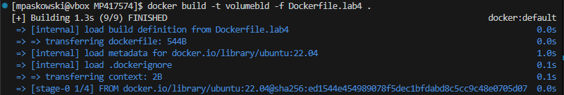

```bash
#Uruchomienie kontenera w tle
docker run -d --name cjson-temp cjson-builder

#Kopiowanie plików z kontenera
docker cp cjson-temp:/output ./output
```

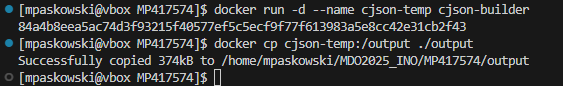

`RUN --mount` w docker build tymczasowo udostępnia pliki hosta, ale nie zapisuje zmian na stałe. By zachować wyniki kompilacji, lepiej użyć `docker run` z woluminem lub `docker cp` do przeniesienia plików. Build generuje artefakty, a run eksportuje je na hosta.

### Eksponowanie portu
Uruchomienie serwera iperf3 w kontenerze:
```bash
#Uruchomienie 
docker run -it --name iperf-server --network iperf-net -p 5201:5201 ubuntu bash

#Wewnatrz
apt update
apt install -y iperf3
iperf3 -s #Uruchomienie serwera
```

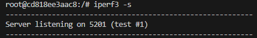

W drugim terminalu utworzyłam kontener klienta:

```bash
#Utworzenie kontenera klienta
docker run -it --network iperf-net --name iperf-client ubuntu bash

#Wewnatrz
apt update && apt install -y iperf3
iperf3 -c iperf-server
```


Badanie ruchu:
```bash
docker stats iperf-server iperf-client
```


Utworzyłam własną dedykowaną sieć mostkową (bridge):

```bash
docker network create --driver bridge iperf-net
#Sprawdzenie
docker network ls
```


Sprawdziłam IP hosta i przetestowałam połączenie z serwerem iperf3 bezpośrednio z niego.

```bash
docker inspect iperf-server | grep IPAddress

iperf3 -c 172.18.0.2 -p 5201
```


Przetestowałam połączenie z innego komputera w sieci:


Gdy chcemy połączyć się z `iperf-server`:


Aby wyniki były zapisywane wykonałam polecenia:
```bash
#Serwer
iperf3 -s --logfile /results/server.log

#Klient
iperf3 -c iperf-server --logfile /results/client.log

#Używając woluminu
 docker run -it --name iperf-server --network iperf-net -p 5201:5201 -v $(pwd)/results:/results ubuntu bash
 
 docker run -it --network iperf-net --name iperf-client -v $(pwd)/results:/results ubuntu bash
 ```

Na serwerze:


Na kliencie:


Używając woluminu:


### Instalacja Jenkins
Utworzyłam nową sieć `docker network create jenkins-net` i uruchomiłam kontener DIND(Docker-in-Docker). Nowa sieć jenkins-net ma własną pulę IP, więc kontenery w tej sieci nie konfliktują z kontenerami w domyślnej sieci bridge oraz port 8080 będzie dostępny tylko dla kontenera Jenkinsa.

```bash
docker run --name jenkins-dind \
  --network jenkins-net \
  --privileged \
  -d \
  docker:dind
```

Następnie utworzyłam kontener Jenkinsa:
```bash
docker run --name jenkins \
  --network jenkins-net \
  -p 8080:8080 -p 50000:50000 \
  -v jenkins_home:/var/jenkins_home \
  -v /var/run/docker.sock:/var/run/docker.sock \
  -d \
  jenkins/jenkins:lts-jdk11

#Aby sprawdzić działanie
docker logs jenkins
```

Aby pobrac hasło inicjalizacyjne
```bash
docker logs jenkins-dind

docker exec jenkins-dind cat /var/jenkins_home/secrets/initialAdminPassword
```


Do sprawdzenia poprawnosci wchodzimy w przegladarke wpisujemy adres IP oraz uzyskane wczesniej haslo `07cbcdbbc6dc424ebdafa7ebf2a60ad2`.

```bash
http://192.168.0.7:8080
```


## Wykorzystanie sztucznej inteligencji podczas zajęć:
- W ramach zajęć korzystałam z platrormy `GPT` oraz `DeepSeak`.
- Werifikowałam informację z przerobionymi przykładami podczas zajęć.