# **Zaliczenie Poprawkowe**

# Krok 1 - wybór oprogramowania

---

### Moim wyborem jest [Andy Grunwald - simple web server](https://github.com/andygrunwald/simple-webserver).
Powody, czemu wybrałam to oprogramowanie:
1. Prostota - to prosty serwer HTTP napisany w języku Go
2. Przeznaczenie - przeznaczeniem projektu jest testowanie technologii takich jak Docker, Marathon / Apache Mesos, Kubernetes, API blueprint, co pokrywa się z zadaniami, które należy wykonać w ramach Projektu Zaliczeniowego.
3. Jasny opis technologii użytych w projekcie przez autora.
4. Zawiera testy i spełnia wymagania opisane w instrukcji.
5. Licencja MIT - pozwala na modyfikację, kopiowanie i używanie programu w calach prywatnych i komercyjnych : 
   
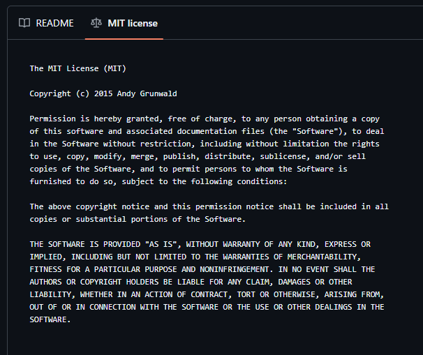

### Uruchomienie builda i testów poza kontenerem:
1. Klonowanie repozytorium
   
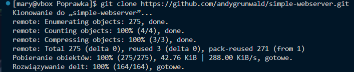

2. Instalacja go oraz potrzebnych zależności

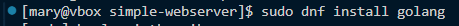

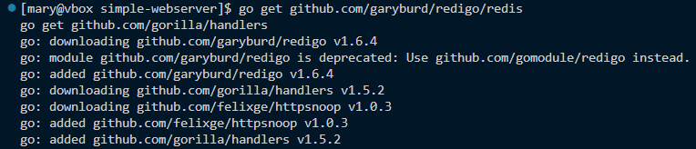
   
3. Uruchomienie builda

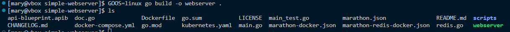

4. Uruchomienie serwera

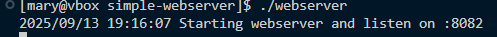

5. Weryfikacja otwarcia portu 8082

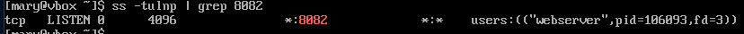

6. Sprawdzenie komunikacji - terminal

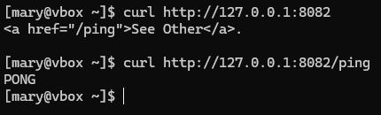

7. Sprawdzenie komunikacji - graficznie

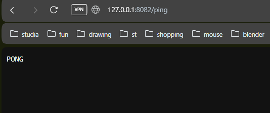

Testy projektu są proste, ale sprawdzają funkcjonalność serwera HTTP czyli funkcję aplikacji :

PingHandler testuje endpoint /ping i sytuację błędu w backendzie 

VersionHandler testuje endpoint /version

Killhandler testuje endpoint /kill

EnvOrDefault testuje fallback i ustawianie zmiennych środowiskowych

Znajdują się w plikut main_test.go

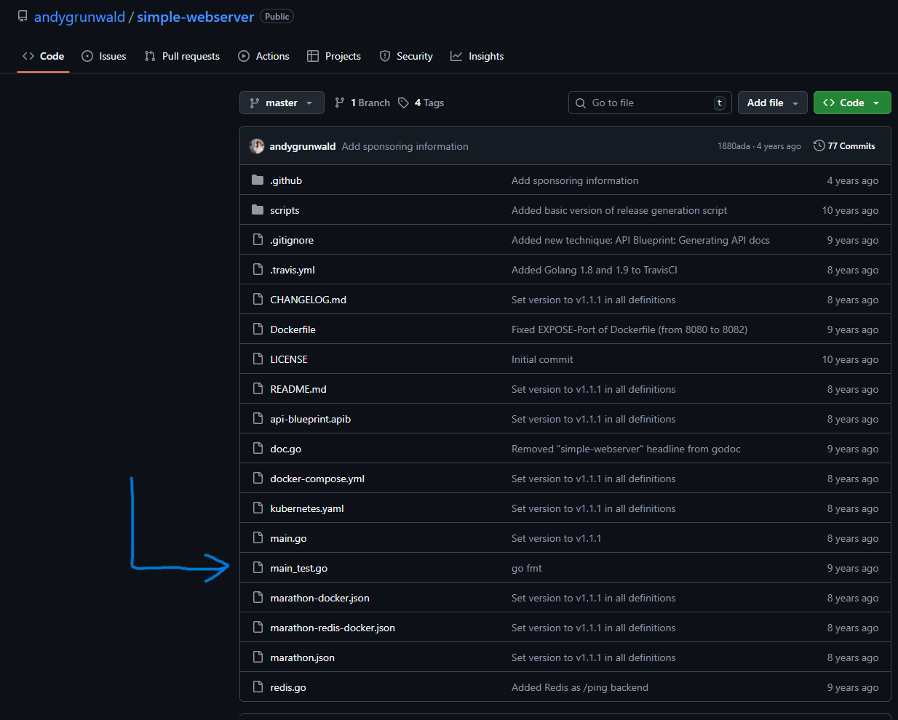

8.Uruchomienie testów

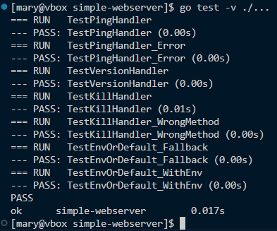

### Wykazanie działającej aplikacji w kontenerze

Używam kontenera na bazie golang:1.24-alpine ponieważ ma Go i jest lekkim systemem alpine lżejszym niż fedora

Dockerfile: 

```
FROM golang:1.24-alpine AS build

WORKDIR /app
COPY . .

RUN go mod tidy && go build -o webserver .

FROM alpine:latest
WORKDIR /root/

COPY --from=build /app/webserver .

EXPOSE 8082
CMD ["./webserver"]
```
Najpierw używam polecenia docker build,

Następnie docker run z konfiguracją -p 8082:8082 <- mapowanie port 8082 na hosta

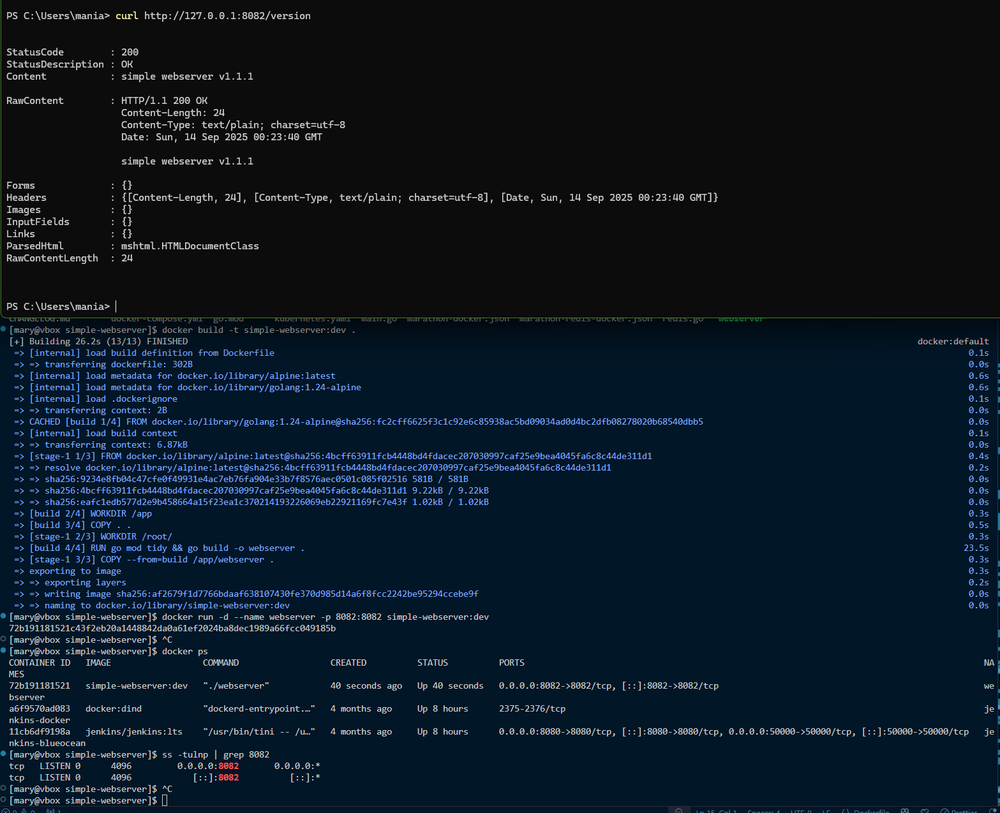

Następnie sprawdzenie w przeglądarce:

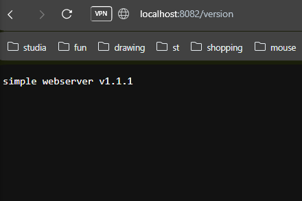

### Zforkowanie repozytorium

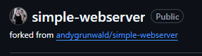

Zklonowanie zforkowanego repozytorium do maszyny wirtualnej: 

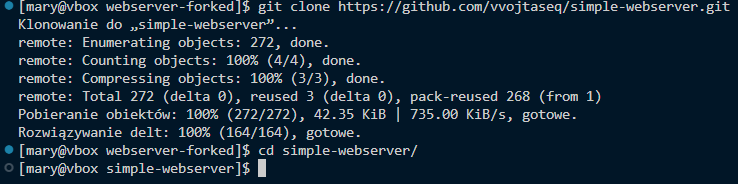

Oryginalne repozytorium simple-webserver posiada przykładowy dockerfile i docker compose, ale nie używam ich więc usunęłam je z katalogu projektu (tak samo jak wszystkie pliki od marathona).

Następnie w katalogu projektu dodałam stworzony wcześniej Dockerfile

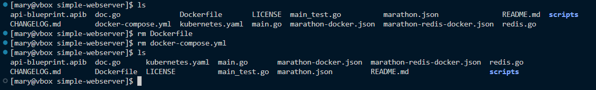

I stworzyłam commit do zforkowanego repozytorium

# Krok 2 - Jenkins

Ten krok wymaga zestawienia nowej instancji jenkins pod kontrolą systemu Fedora bez GUI (poprzednie kroki również wykonywałam na tym systemie)

### Specyfikacje systemu: 

&nbsp;&nbsp;**Przydzielone zasoby :**

&nbsp;&nbsp;VRAM - 51 MB

&nbsp;&nbsp;RAM - 5664 MB

&nbsp;&nbsp;4 CPU

Loguję się do maszyny wirtualnej z głównego systemu operacyjnego <em>(Windows 11)</em> przez protokół SSH.

Lączę się z maszyną używając opcji NAT Network w Virtual box z zasadą port forwarding adresu 127.0.0.1 ((localhost) przez port 2222) czyli <em>lo</em> a nie <em>enp0s3</em> i do pracy nad maszyną używam wtyczki RemoteSSH w Visual Studio Code ponieważ jest to o wiele wygodniejsze, zapewnia prosty sposób przesyłania plików między głównym systemem a VM i graficzną reprezentację ułożenia plików.
Żeby instancja Jenkins była dostępna poza maszyną wirtualną dodałam drugą zasadę port forwarding dotyczącą portu 8080 

Przy stosowaniu tego rozwiązania Instancja Jenkins jest dostępna dzięki port forwardingowi, co oznacza, że jest dostępna **jedynie przez localhosta, jedynie na komputerze, na którym znajduje się VM**, co jest dużym minusem tego rozwiązania, jednak dla mnie ważniejsza była stabilność adresu IP.

By każda maszyna w sieci lokalnej miała dostęp do jenkinsa trzeba użyć ustawienia **Bridged Adapter** w ustawieniach sieciowych maszyny wirtualnej, sprawdzić nadany adres ip (ip a), następnie w przeglądarce uruchomić jenkinsa używając adresu ip maszyny wirtualnej. 

Rozwiązanie z użyciem Bridged Adapter umożliwia dostęp do adresu instancji Jenkinsa wszystkim użytkownikom sieci lokalnej.

Nie zdecydowałam się na to rozwiązanie z powodu tego, że przy przy używaniu Bridged Adapter adres ip maszyny często się zmieniał i było to bardzo uciążliwe - dzieje się tak ponieważ adres ip przydziela router DHCP i z każdym ponownym uruchomieniem VM router może przydzielić maszynie inną wolną pulę adresów.

Można zkonfigurować ręcznie statyczny adres IP ,ale w przypadku zmiany sieci, z którą łączy się komputer IP może przestać działać, mogą też wystąpić konflikty IP jeśli inne urządzenie dostałoby ten sam adres z DHCP.

Często zmieniam sieć jaką używam (częste awarie sieci ze względu na moje miejsce zamieszkania, co zmusza mnie do używania wireless hotspotu z telefonu, co powoduje zmianę adresu ip) więc nistety używanie Bridged Adapter nie było dla mnie sensowną opcją.


Zasady port forwarding NAT Network w VirtualBox (Tools->Network->NAT Networks->Port Forwarding)

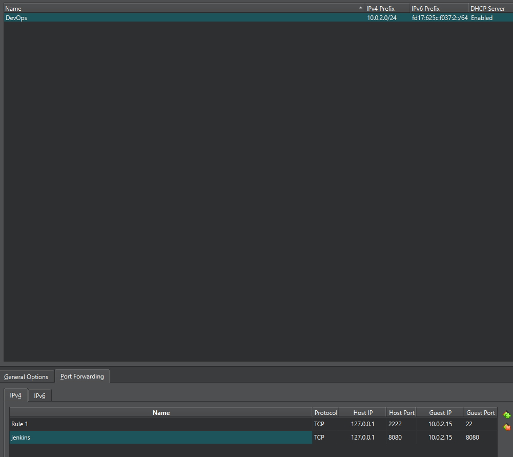

## Instalacja i konfiguracja Jenkinsa

 W celu uruchomienia instancji jenkinsa wykonałam następujące kroki:

 1. Pobrałam obraz jenkinsa
```
docker pull jenkins/jenkins:lts
```
 1. Utworzyłam Dockerfile.jenkins
```
FROM jenkins/jenkins:lts

USER root

RUN apt-get update && \
    apt-get install -y apt-transport-https ca-certificates curl gnupg2 lsb-release software-properties-common && \
    curl -fsSL https://download.docker.com/linux/debian/gpg | gpg --dearmor -o /usr/share/keyrings/docker-archive-keyring.gpg && \
    > /etc/apt/sources.list.d/docker.list && \
    apt-get update && \
    apt-get install -y docker-ce-cli

USER jenkins
```
```
docker run -d \
  --name jenkins \
  -p 8080:8080 \
  -p 50000:50000 \
  -v jenkins_home:/var/jenkins_home \
  -v /var/run/docker.sock:/var/run/docker.sock \
  jenkins/jenkins:lts
```
 1. Uruchomiłam kontener
```
docker start -ai jenkins
```
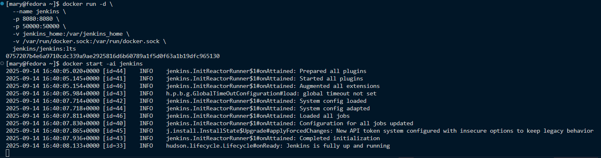

hasło startowe znalazłam w kontenerze : 
```
docker exec -it jenkins cat /var/jenkins_home/secrets/initialAdminPassword
```


Następnie w przeglądarce weszłam na adres http://localhost:8080

Co przekierowało mnie na stronę logowania, gdzie wpisałam hasło odczytane wcześniej

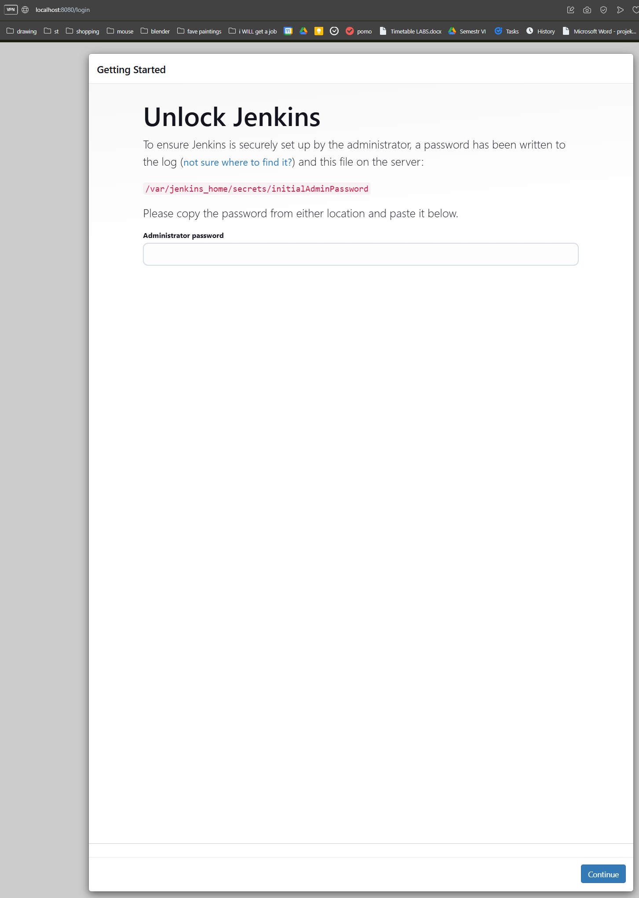

Następnie zainstalowałam pluginy sugerowane przez Jenkins

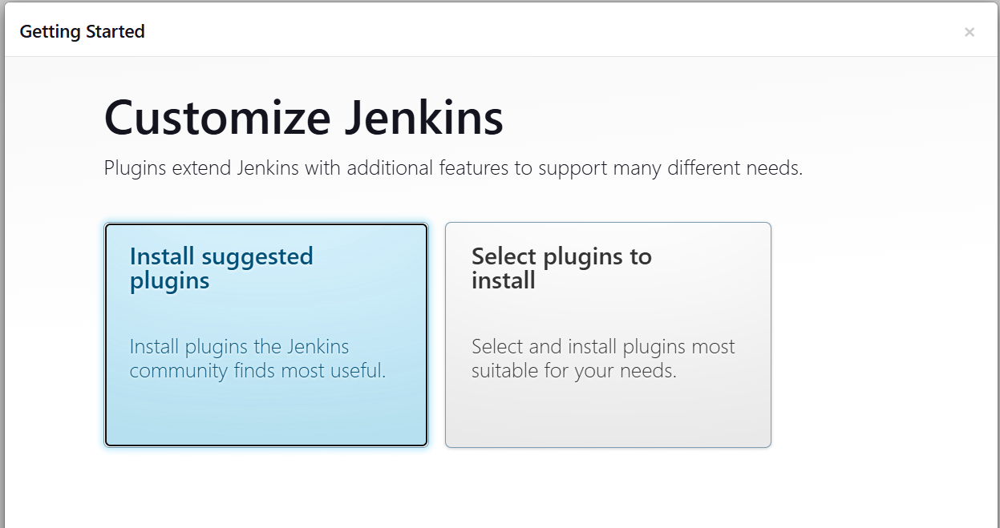

Po czym stworzyłam użytkownika admin 

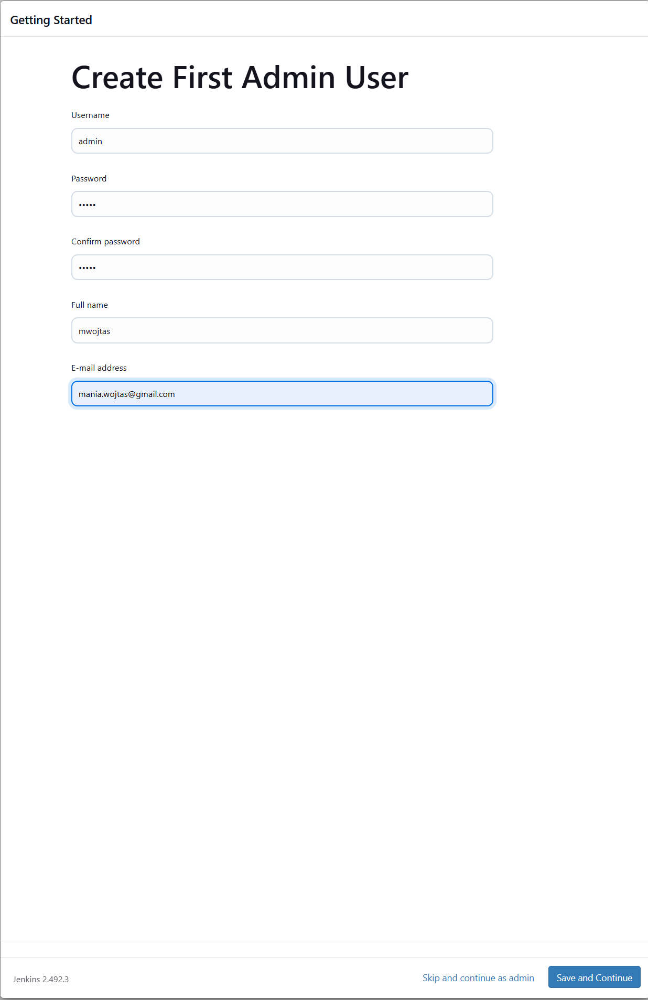

Ustawienia bezpieczeństwa: 

Żeby zabezpieczyć instancję, by uruchamianie nowego builda i czytanie pełnych logów wymagało zalogowania mamy dwie opcje 

1. Authorization -> Logged-in users can do anything

Każdy **zalogowany** użytkownik ma pozwolenie na wszystko.

Nie zalogowani użytkownicy nie mają uprawnień.

2. Authorization -> Matrix-based security

Matrix-based security daje nam precyzyjną kontrolę, możemy wybrać dokładnie, kto ma do czego uprawnienia: 

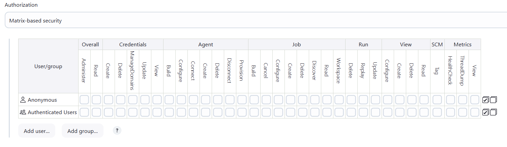

Dla potrzeb projektu **wybrałam opcję Logged in users can do anything** ze względu na prostotę i spełnienie wymagań projektu, ale w przypadku kolaboracji z innymi użytkownikami ustawienie Matrix-based security byłoby bardziej stosowne.

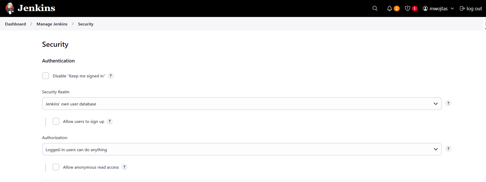

Dla weryfikacji ustawień bezpieczeństwa, uruchomiłam przeglądarkę w trybie incognito i wpisałam ustalony adres jenkinsa:

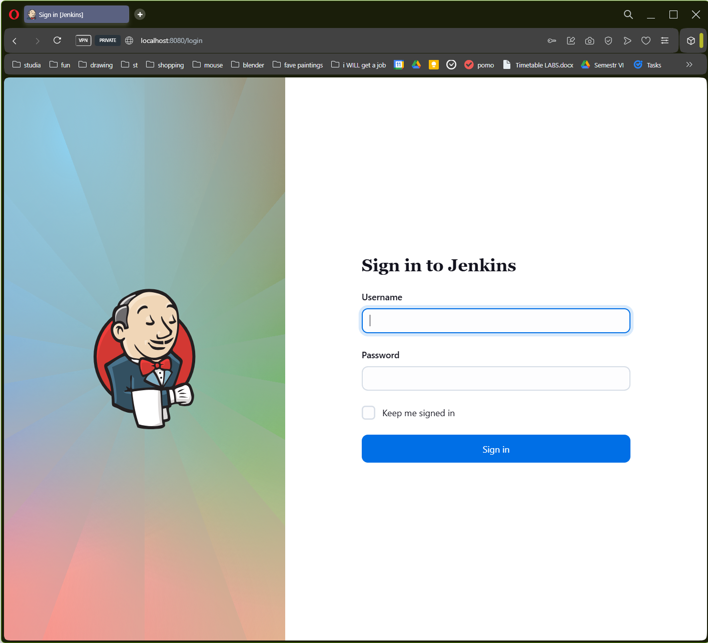

Jak widać, Jenkins wymaga zalogowania, co potwierdza, że ustawienia bezpieczeństwa działają.

Jeszcze jednym krokiem, który musiałam wykonać, było

# Pipeline

Jenkinsfile: 
```
pipeline {
    agent any

    environment {
        IMAGE_NAME = "simple-webserver"
        BUILDER_IMAGE = "simple-webserver/builder:1.0"
        RUNTIME_TAG = "${env.BUILD_ID}"
        DOCKER_REGISTRY = "https://index.docker.io/v1/"
        DOCKER_CREDENTIALS_ID = "docker-hub-credentials"
    }
    
    stages {
        stage('Build builder image') {
            steps {
                sh "docker build -t ${BUILDER_IMAGE} -f Dockerfile.build --target builder ."
                archiveArtifacts artifacts: 'webserver', fingerprint: true
            }
        }

        stage('Build runtime image') {
            steps {
                sh "docker build -t ${IMAGE_NAME}:${RUNTIME_TAG} -f Dockerfile.build ."
            }
        }

        stage('Test') {
            steps {
                script {
                def mountStatus = sh(returnStatus: true, script: """
                    docker run --rm -v ${env.WORKSPACE}:/app -w /app ${BUILDER_IMAGE} \
                    sh -c 'test -f /app/go.mod || exit 2; go mod tidy && go test ./... -v | tee /app/test-output.txt || true'
                """)

                if (mountStatus != 0) {
                    def cid = sh(returnStdout: true, script: """
                    docker run -d ${BUILDER_IMAGE} sh -c 'cd /app && go test ./... -v | tee /app/test-output.txt || true'
                    """).trim()
                    sh "docker wait ${cid}"
                    sh "docker cp ${cid}:/app/test-output.txt ${env.WORKSPACE}/test-output.txt || true"
                    sh "docker logs ${cid} > ${env.WORKSPACE}/docker-test-logs.txt || true"
                    sh "docker rm ${cid} || true"
                }

                if (!fileExists('test-output.txt')) {
                    sh "echo 'NO test-output.txt produced. Check docker-test-logs.txt for details.' > ${env.WORKSPACE}/test-output.txt || true"
                }
                }

                archiveArtifacts artifacts: 'test-output.txt,docker-test-logs.txt', fingerprint: true
            }
        }
        
        stage('Deploy') {
            steps {
                script {
                    sh """
                        docker network rm my-app-network || true
                        docker network create -d bridge my-app-network || true
                        docker rm -f redis-container simple-webserver-container || true
                        docker run -d --name redis-container --network my-app-network redis:7-alpine
                        docker run -d --name simple-webserver-container --network my-app-network \
                            -p 8082:8082 simple-webserver:${RUNTIME_TAG} \
                            ./webserver -redis redis-container:6379
                    """
                }
            }
        }

        stage('Health Check') {
            steps {
                script {
                    sh '''
                        i=1
                        max_retries=10
                        success=0
                        while [ $i -le $max_retries ]; do
                            if docker run --rm --network my-app-network \
                                curlimages/curl:8.7.1 curl -f http://simple-webserver-container:8082/ping; then
                                success=1
                                break
                            fi
                            sleep 3
                            i=$((i + 1))
                        done
                        if [ $success -ne 1 ]; then
                            echo "Health check failed"
                            exit 1
                        fi
                    '''
                }
            }
        }
        stage('Post-Health Cleanup') {
            steps {
                script {
                    sh "docker rm -f simple-webserver-container || true"
                }
            }
        }
        stage('Publish') {
            steps {
                withCredentials([usernamePassword(credentialsId: 'docker-hub-credentials', usernameVariable: 'DOCKER_USER', passwordVariable: 'DOCKER_PASS')]) {
                    sh """
                        echo "$DOCKER_PASS" | docker login -u "$DOCKER_USER" --password-stdin
                        docker tag simple-webserver:${RUNTIME_TAG} vvojtasek/simple-webserver:${RUNTIME_TAG}
                        docker push vvojtasek/simple-webserver:${RUNTIME_TAG}
                    """
                }
            }
        }
        stage('Staging') {
            steps {
                script {
                    sh """
                        docker network create -d bridge staging-network || true
                        docker rm -f redis-staging simple-webserver-staging || true

                        docker run -d --name redis-staging --network staging-network redis:7-alpine
                        docker run -d --name simple-webserver-staging --network staging-network \
                            -p 8083:8082 vvojtasek/simple-webserver:${RUNTIME_TAG} \
                            ./webserver -redis redis-staging:6379

                        sleep 5
                        docker run --rm --network staging-network curlimages/curl:8.7.1 \
                            curl -f http://simple-webserver-staging:8082/ping

                        docker rm -f simple-webserver-staging redis-staging || true
                    """
                }
            }
        }

    }
}

```
Build Pipeline na Jenkins zakończony sukcesem:

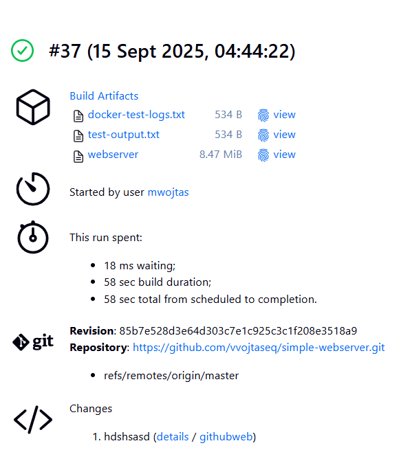

### Wersjonowanie

Wersjonowanie zapewnia element RUNTIME_TAG w pipeline - każdy obraz runtime jest wersjonowany unikalnym numerem builda Jenkins BUILD_ID


## Build


### Wybór kontenera bazowego

Moim kontenerem bazowym w fazie build jest **golang:1.24-alpine** (tak jak w poprzednim kroku, kiedy testowałam webserver w kontenerze), z powodów: 
1. Wersja Go odpowiada wersji lokalnej 1.24
2. Alpine gwarantuje mały rozmiar i szybkie pobieranie
3. Projekt jest prosty z minimalną ilością depencencji więc nie ma potrzeby na nic bardziej skomplikowanego

Ten obraz nie ma wbudowanego gita, więc w Dockerfile go dodaję


### Zaopatrzenie kontenera w dependencje 

Zdecydowałam się nie tworzyć osobnych dockerfilów do builda i runtime, tylko stworzyć **Multi-stage Dockerfile** 

```
PFROM golang:1.24-alpine AS builder

RUN apk add --no-cache git ca-certificates

WORKDIR /app

RUN git config --global --add safe.directory /app

COPY go.mod go.sum ./
RUN go mod tidy

COPY . .

RUN go build -v -o webserver -ldflags '-extldflags "-static"' -buildvcs=false .

#runtime
FROM alpine:latest
WORKDIR /root/

COPY --from=builder /app/webserver .

EXPOSE 8082

CMD ["./webserver"]
```
część odpowiadająca za krok build znajduje się w części FROM golang:1.24-alpine AS builder

docker-compose.yml : 

```
services:
  redis:
    image: redis:7-alpine

  simple-webserver:
    build:
      context: .
      dockerfile: Dockerfile.build   # use your build Dockerfile
    image: myorg/simple-webserver:latest
    command: ["./webserver", "-redis", "redis:6379"]
    depends_on:
      - redis
    ports:
      - "8082:8082"

```

Kontener bazowy nie wymaga wielu dependencji : jedyne, jakie są potrzebne to Go, git oraz ca-certificates, co jest bardzo minimalną ilością dependencji, jeśli byłoby ich więcej warto stworzyć obraz build-dependencies i to jego użyć jaki kontener bazowy.

Bez dependencji build nie mógłby się wykonać.


### Zbudowanie programu w kontenerze buildowym

Za budowanie programu w kontenerze buildowym odpowiada sekcja 'Build builder image' 

```
    stages {
        stage('Build builder image') {
            steps {
                sh "docker build -t ${BUILDER_IMAGE} -f Dockerfile.build --target builder ."
                archiveArtifacts artifacts: 'webserver', fingerprint: true
            }
        }

```
Za budowanie  obrazu runtime odpowiada: 
```
        stage('Build runtime image') {
            steps {
                sh "docker build -t ${IMAGE_NAME}:${RUNTIME_TAG} -f Dockerfile.build ."
            }
        }
```
## Test

Skrypt próbuje uruchomić testy z zamontowanym katalogiem workspace, sprawdza, czy w katalogu istnieje go.mod (jeśli nie, zwraca 2). Następnie instaluje zależności, uruchania testy, zapisuje wynik do pliku i nie przerywa kontenera, nawet jeśli testy się nie powoiodą.
returnStatus: true zwraca kod zakończenia zamiast kończyć pipeline w przypadku błędu.

W przypadku prostszej wersji bez obsługi przypadków miałam problem z wolumenami Dockera i prawami do plików - mount się nie udawał, nie powstawał test-output.txt, a pipeline kończył się błędem.

### Użycie buildera jako obraz bazowy

```
        stage('Test') {
            steps {
                script {
                def mountStatus = sh(returnStatus: true, script: """
                    docker run --rm -v ${env.WORKSPACE}:/app -w /app ${BUILDER_IMAGE} \
                    sh -c 'test -f /app/go.mod || exit 2; go mod tidy && go test ./... -v | tee /app/test-output.txt || true'
                """)

                if (mountStatus != 0) {
                    def cid = sh(returnStdout: true, script: """
                    docker run -d ${BUILDER_IMAGE} sh -c 'cd /app && go test ./... -v | tee /app/test-output.txt || true'
                    """).trim()
                    sh "docker wait ${cid}"
                    sh "docker cp ${cid}:/app/test-output.txt ${env.WORKSPACE}/test-output.txt || true"
                    sh "docker logs ${cid} > ${env.WORKSPACE}/docker-test-logs.txt || true"
                    sh "docker rm ${cid} || true"
                }

                if (!fileExists('test-output.txt')) {
                    sh "echo 'NO test-output.txt produced. Check docker-test-logs.txt for details.' > ${env.WORKSPACE}/test-output.txt || true"
                }
                }

                archiveArtifacts artifacts: 'test-output.txt,docker-test-logs.txt', fingerprint: true
            }
        }
```
### Testy zbudowanej aplikacji

Wyniki testu znajdują się w artefaktach builda: 

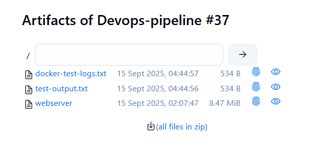

### Zapewnienie dostępności logów i możliwości wnioskowania, jakie testy nie przechodzą

Wszsystkie testy zakończyły się sukcesem: 

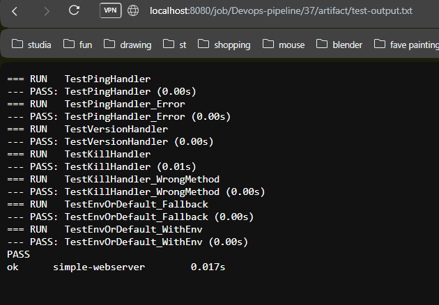


# Krok 3 - Deploy

Etap deploy dzielę na dwa etapy 

1. Deploy

Tworzy izolowaną sieć dla kontenera, by inne kontenery mogły się w niej komunikować

|| true ignoruje błąd, jeśli sieć już istnieje i unika zatrzymania pipelinu

Potem usuwa stary kontener, i odpala nowy kontener **runtime**.

2. Health Check

Health Check polega na tworzeniu tymczasowego kontenera z obrazem curl, który na celu ma sprawdzenie, czy aplikacja działa w sieci Dockera

-f sprawia, że curl zwróci błąd, jeśli serwer odpowie błędem HTTP
   
```   
        stage('Deploy') {
            steps {
                script {
                    sh """
                        docker network create -d bridge my-app-network || true
                        docker rm -f redis-container simple-webserver-container || true
                        docker run -d --name redis-container --network my-app-network redis:7-alpine
                        docker run -d --name simple-webserver-container --network my-app-network \
                            -p 8082:8082 simple-webserver:${RUNTIME_TAG} \
                            ./webserver -redis redis-container:6379
                    """
                }
            }
        }

        stage('Health Check') {
            steps {
                script {
                    sh '''
                        i=1
                        max_retries=10
                        success=0
                        while [ $i -le $max_retries ]; do
                            if docker run --rm --network my-app-network \
                                curlimages/curl:8.7.1 curl -f http://simple-webserver-container:8082/ping; then
                                success=1
                                break
                            fi
                            sleep 3
                            i=$((i + 1))
                        done
                        if [ $success -ne 1 ]; then
                            echo "Health check failed"
                            exit 1
                        fi
                    '''
                }
            }
        }
```
# Dyskusja na temat wdrożenia docelowego aplikacji

### Dlaczego taki sposób wdrażania aplikacji?
1. Rozdzielamy build i runtime 
   Dzięki temu mamy lekki runtime image, ktry jest lekki, nie zawiera narzędzi do budowania, co zmniejsza ten obraz i ogranicza ryzyko np. wycieków informacji.
2. Izolacja
   Kontener działa w dedykowanej sieci Dockera, co ułatwia testowanie serwisów i interakcji między kontenerami w bezpieczny sposób
3. Powtarzalność i wersjonowanie
   Każdy build to nowy obraz i nowy kontener, dzięki temu możemy powtarzać wdrożenie aplikacji, a starsze wersje mogą być łatwo usunięte lub zarchiwizowane.
4. Sprawdzanie konfiguracji
   Health check jest automatycznym testem, który pozwoli wykryć problemy z konfigurają, portami lub zależnościami, zanim pipeline przejdzie do następnych etapów.

# Decyzje dotyczące dystrybucji aplikacji

### Pakowanie aplikacji? 

Nie zawsze, w tym przypadku najlepsza jest dystrybucja docker image, ponieważ umożliwia uruchomienie w każdym środowisku, które ma Dockera, i zamyka wszystkie zależności runtime w odizolowanym kontenerze.

### Co ma zawierać obraz Docker?

Jedynie skompilowaną aplikację webserver

**Bez** repozytorium, kodu źródłowego, narzędzi buildowych, logów, artefaktów, testów

Ponieważ pakowanie całego repozytorium i logów zwiększałoby rozmiar obrazu, byłoby całkowicie niepotrzebne do uruchomienia aplikacji, a obraz powinien być lekki i powtarzalny.

# Krok 4 - Publish

Dodanie credentials z docker huba do jenkinsa : 

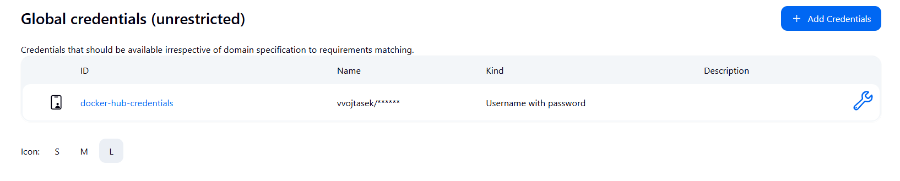

# Krok 5 - Staging

