# Sprawozdanie - Projekt Zaliczeniowy

### Wybór Aplikacji

Wybór Aplikacji - Flask 
Na potrzeby projektu wybrano aplikację Flask na której postawimy sobie naszą własną plikację:
Spełnienie wymagań technicznych:

**Port TCP**

Aplikacja będzie słuchała na porcie 3000 (127.0.0.1:3000), co spełnia wymaganie aplikacji wyprowadzającej port TCP
Aplikacja uruchamia serwer WWW na określonym porcie przez Flask framework

**Testy w repozytorium**

Projekt zawiera folder test/ z unit testami używającymi pytest
Struktura testów zgodna z konwencją: test_*.py pliki z klasami Test* i metodami test_*

**Konteneryzacja**

Aplikacja w pełni przygotowana do pracy w Docker containers
Wykorzystuje docker-compose do orkiestracji kontenerów

**Licencja**

BSD 3 - pozwala na swobodne użycie w celach edukacyjnych

### Przygotowanie Maszyny Wirtualnej
Przed rozpoczęciem jakiejkolwiek pracy musimy mieć przygotowaną maszynę wirtualną, na potrzeby naszego projektu skorzystamy z sytemu operacyjnego Fedora Everything bez systemu graficznego.

Do przygotowanie takiej maszyny będą nam jedynie potrzebne:
- Aplikacja do wirtualizacji Oracle Virtualbox
- Plik .iso zawierający system operacyjny Fedora

Po dodaniu sobie takiej maszyny w virualbox i uzupełnieniu ją o dowolną
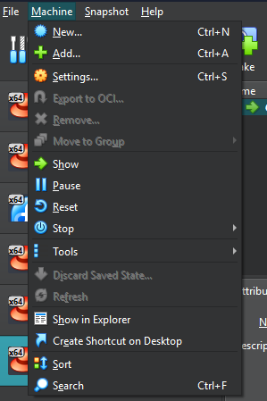
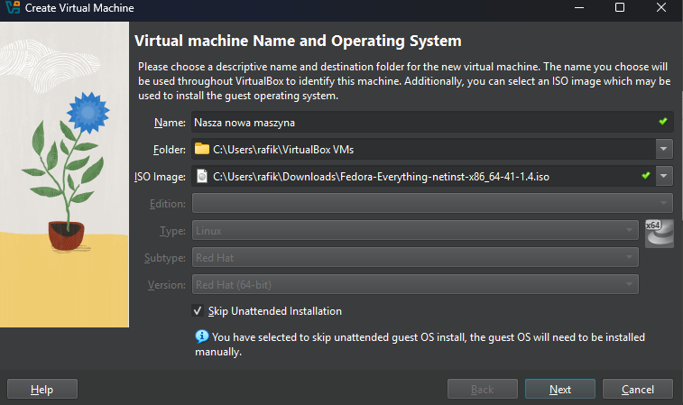

Po dodaniu maszyny uruchamiamy ją i przechodzimy przez proces instalacji, ustawienia wybieramy według preferencji, ważne jednak aby nie zapomnieć o dodaniu konta admina i usera.
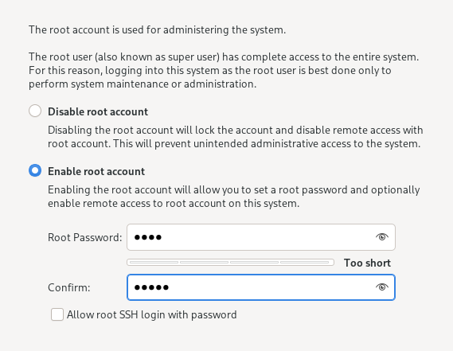

Gdy już mamy to załatwione możemy śmiało rozpocząć instalację.
Po instalacji systemu, nie uruchamiamy jeszcze maszyny, wchodzimy w ustawienia sieciowe i ustawiamy bridged adapter jak adapter sieciowy.
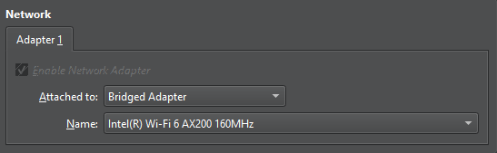

Następnie, uruchamiamy ponownie maszynę i logujemy się.
Efekt powinien być podobny jak poniżej:

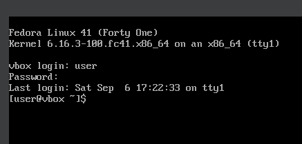

### Łączenie z terminalem
Teraz w celu łatwiejszej pracy, połączymy sobie naszą maszynę wirtualną Fedora z a zamysł jest taki aby móc przemieszczać się po zawartości maszyny i korzystać w tym celu z terminala.

Na naszej maszynie Fedora instalujemy opensshd-server za pomocą poniżej komendy

    sudo dnf install -y openssh-server

Jeżeli instalacja przebiegła pomyślnie, uruchamiamy usługę sshd

    sudo systemctl enable sshd --now

W celu sprawdzenia czy cały proces się powiódł, podglądamy status sshd

    systemctl status sshd

Efekt końcowy powinien wyglądać podobnie do tego poniżej

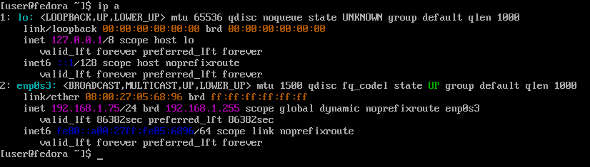

Następnie nie wyłączając maszyny w naszym systemue uruchamiamy terminal i wpisujemy komendę zgodnie ze wzorem

    ssh [NAZWA_UŻYTKOWNIKA]@[ADRES_IP]

Przy logowqaniu podajemy hasło i efekt powinien wyglądać podobnie jak poniżej.

## Set Up Githuba

Teraz kiedy możemy wygodnie poruszać się po naszej maszynie, czas na sklonowanie repozytorium i przygotowanie gałęzi na której będziemy pracować.

Zaczniemy od instalacji git'a i ustawienia email konta github z którym będziemy pracować
    
    sudo dnf install git -y
    
    git config --global user.email "[EMAIL]"

Teraz przejdziemy do stworzenia klucza SSH który zabezpieczymy hasłem.

    ssh-keygen -t ed25519 -C "[EMAIL]"

Po utworzeniu klucza uruchamiamy proces SSH agenta i dodajemy do niego klucz

    eval "$(ssh-agent -s)"

    ssh-add [NAZWA_KLUCZA]

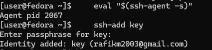

**Konfiguracja klucza na githubie**

W celu konfiguacji klucza najpierw kopiujemy sobie jego zawartość 

    cat key.pub

Następnie w naszym profilu na githubie przechodzimy do sekcji 

*Settings > SSH and GPG keys > New SSH key*

I tam dodajemy skopiowany klucz publiczny, 
Finalnie powinieneś widzieć klucz z ikoną jak poniżej.

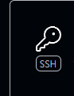

Teraz wykorzystamy klucz do sklonowania repozytorium protokołem ssh

    git clone git@github.com:InzynieriaOprogramowaniaAGH/MDO2025_INO.git

Zostało nam tylko przełączyć się na odpowiednią gałąź i możemy zaczynać pracę
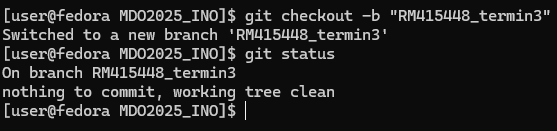

## Set Up Dockera

Instalujemy dockera
    
    sudo dnf install docker docker-compose -y

Uruchamiamy docker jako usługę systemową oraz sprawdzamy czy docker działa

    sudo systemctl enable docker --now
    sudo docker --version
    sudo systemctl status docker

Finalnie powinno to wyglądać jak poniżej

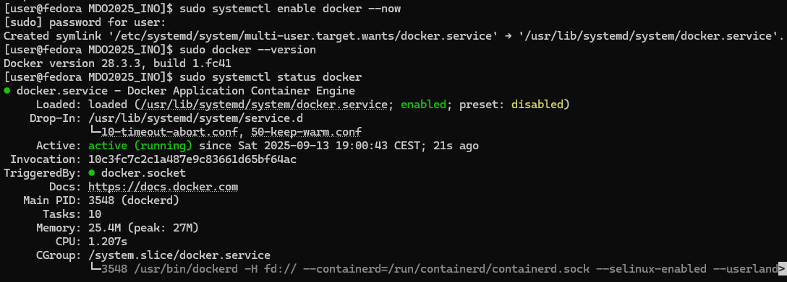

Skoro nasz docker jest w pełni działający czas dodać się do grupy użytkowników dockera

    # Dodajemy użytkownika do grupy
    sudo usermod -aG docker [NAZWA_UŻYTKOWNIKA]

    # Sprawdzamy grupy użytkownika
    groups [NAZWA_UŻYTKOWNIKA]

## Set Up Aplikacji
Klonujemy repozytorium aplikacji i prygotowujemy środowisko

    git clone https://github.com/pallets/flask/tree/main

    # 1. Utworzenie wirtualnego środowiska
    python3 -m venv venv

    # 2. Aktywacja środowiska
    source venv/bin/activate

    cd flask
Po tych krokach w terminalu powinniśmy mieć coś takiego

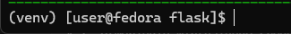

Teraz instalujemy potrzebne paczki jeśli jeszcze tego nie zrobiliśmy
    
    sudo dnf install python3 python3-venv -y
    pip install pytest

Wchodzimy w folder *flask/examples* i tam tworzymy naszą aplikację app.py o podanej zawartości

    from flask import Flask
    app = Flask(__name__)

    @app.route('/')
    def hello():
        return "Hello, Flask from port 3000!"

    if __name__ == '__main__':
    app.run(host='0.0.0.0', port=3000)

Zanim przejdziemy do uruchomienia fedory kończymy tą sesje ssh i zastępujemy ją bardzo podobną komendą, tym razem jednak z port forwardingiem
    
    ssh -L 3000:127.0.0.1:3000 user@adres_fedory

Uruchamiamy aplikacje za pomocą komendy i na naszej przeglądarce powinniśmy mieć dostęp do strony
    
    python app.py

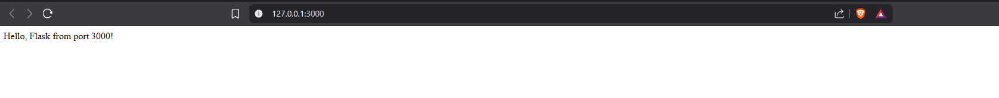

Możemy na chwilę wyłączyć aplikację i zobaczyć jak sprawują się testy,

    pip install -e .[async]
    pytest

Efekt końcowy poniżej

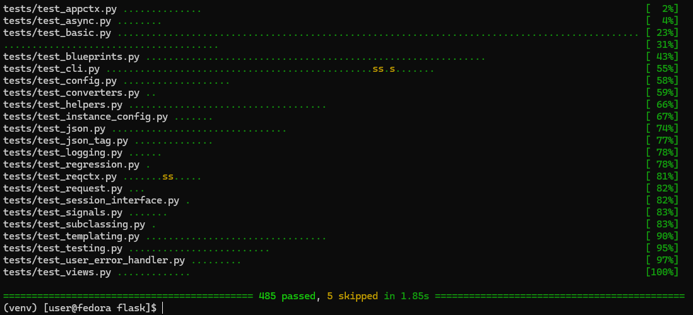

## Dockerfiles

Wchodzimy do folderu nadrzędnego i tworzymy nasz pierwszy dockerfile

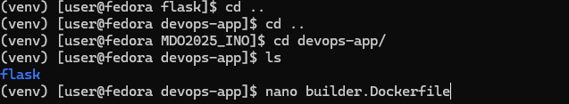

**builder.Dockerfile**

    # builder.Dockerfile
    FROM python:3.9-slim

    # Aktualizacja pakietów i instalacja git
    RUN apt-get update && apt-get install -y git

    # Skopiowanie całego repo Flask do kontenera
    COPY flask /app

    # Ustawienie katalogu roboczego tam, gdzie jest app.py
    WORKDIR /app/examples

    # Aktualizacja pip i instalacja Flask
    RUN pip install --upgrade pip
    RUN pip install flask

    # Otwieramy port 3000
    EXPOSE 3000

    # Uruchomienie aplikacji
    CMD ["python", "app.py"]

Uruchamiamy kontenerowaną aplikacje i sprawdzamy czy mamy do niej dostęp w przeglądarce

    sudo docker build -f builder.Dockerfile -t flask-app .
    sudo docker run -d -p 3000:3000 flask-app
    
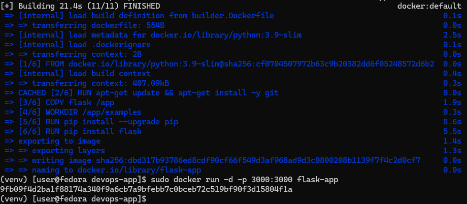

**tester.Dockerfile**

    FROM flask-app

    # Instalacja pytest i zależności developerskich Flask
    RUN pip install pytest

    # Ustawienie katalogu roboczego tam, gdzie są testy
    WORKDIR /app/tests

    # Uruchomienie wszystkich testów
    CMD ["pytest"]

Podobnie jak poprzednio uruchamiamy kontener testowy

    sudo docker build -t test-app -f tester.Dockerfile .
    sudo docker run test-app
    

**deployer.Dockerfile**

    FROM python:3.13-slim

    WORKDIR /app

    # Skopiowanie tylko app.py
    COPY flask/app.py /app

    # Instalacja Flask
    RUN pip install --no-cache-dir flask

    EXPOSE 5000

    CMD ["python", "app.py"]

## Instalacja Jenkinsa

Do instalacji jenkinsa użyjemy poniższej komendzie 

    sudo docker run -d --name jenkins \
    -p 8080:8080 -p 50000:50000 \
    -v jenkins_home:/var/jenkins_home \
    -v /var/run/docker.sock:/var/run/docker.sock \
    docker:dind \
    sh -c "apk add --no-cache openjdk17 git bash curl docker-cli && \
            curl -fsSL https://get.jenkins.io/war-stable/latest/jenkins.war -o /jenkins.war && \
            java -jar /jenkins.war"

Dzięki port forwardingowi dostosujemy zasadę aby jenkins był widoczny na naszej przeglądarce 

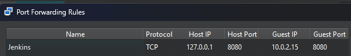
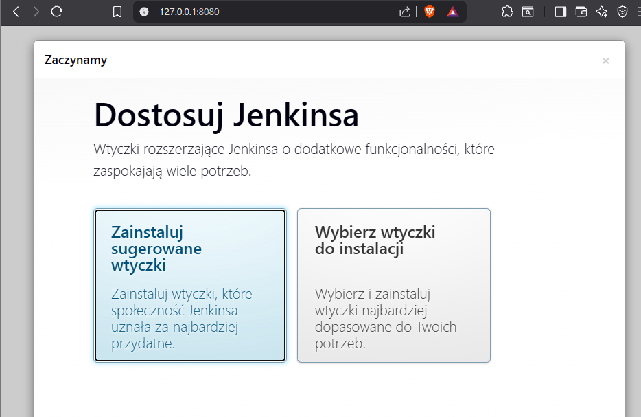

Po zainstalowaniu i konfiguracji jenkinsa z hasłem z logów jedną kluczową rzeczą przed przygotowanie naszego pipeline będzie dodanie rozszerzenia docker abyśmy mogli korzystać z dockerfile które stworzyliśmy.

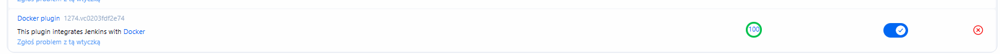

Następnie gdy mamy to odhaczone przechodzimy do przygotowania pipeline, tworzymy nowy projekt pipeline, nazywamy go jak chcemy i w skrypcie pipeline wklejamy poniższą zawartość.

    pipeline {
        agent any

        stages {
            stage('Prep') {
                steps {
                    // Usuń stare repo i sklonuj nowe
                    sh '''
                    rm -rf MDO2025_INO
                    git clone https://github.com/InzynieriaOprogramowaniaAGH/MDO2025_INO.git
                    cd MDO2025_INO
                    git checkout RM415448_termin3
                    '''
                }
            }

            stage('Build') {
                steps {
                    script {
                        dir("MDO2025_INO") {
                            // Budujemy obraz bazowy aplikacji Flask
                            def builderImage = docker.build("flask-app-builder", "-f builder.Dockerfile . 2>&1 | tee build.log")
                            archiveArtifacts artifacts: 'build.log', allowEmptyArchive: true
                        }
                    }
                }
            }

            stage('Test') {
                steps {
                    script {
                        dir("MDO2025_INO") {
                            // Budujemy obraz testowy
                            def testImage = docker.build("flask-app-test", "-f tester.Dockerfile . 2>&1 | tee test-build.log")
                            archiveArtifacts artifacts: 'test-build.log', allowEmptyArchive: true

                            // Uruchamiamy testy wewnątrz kontenera
                            testImage.inside {
                                sh 'pytest 2>&1 | tee test-run.log'
                            }
                            archiveArtifacts artifacts: 'test-run.log', allowEmptyArchive: true
                        }
                    }
                }
            }

            stage('Deploy') {
                steps {
                    script {
                        dir("MDO2025_INO") {
                            // Budujemy obraz do deploya
                            def deployImage = docker.build("flask-app-deploy", "-f deployer.Dockerfile . 2>&1 | tee deploy-build.log")
                            archiveArtifacts artifacts: 'deploy-build.log', allowEmptyArchive: true

                            // Uruchamiamy aplikację Flask w tle
                            deployImage.inside("-p 5001:5001") {
                                sh 'python app.py &'
                            }
                            echo "Flask app powinien działać na porcie 5001"
                        }
                    }
                }
            }
        }
    }

Finalnym wynikiem powinien być przechodzący pipeline i gotowy do pobrania obraz
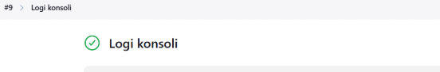

    Started by user user [Pipeline] Start of Pipeline [Pipeline] node Running on Jenkins in /var/jenkins_home/workspace/flask-easy-app [Pipeline] { [Pipeline] stage [Pipeline] { (Prep) [Pipeline] sh + rm -rf MDO2025_INO + git clone -b RM415448_termin3 https://github.com/InzynieriaOprogramowaniaAGH/MDO2025_INO.git Cloning into 'MDO2025_INO'... [Pipeline] } [Pipeline] // stage [Pipeline] stage [Pipeline] { (Build) [Pipeline] dir Running in /var/jenkins_home/workspace/flask-easy-app/MDO2025_INO/devops-app [Pipeline] { [Pipeline] sh + docker build -t flask-app -f builder.Dockerfile . + tee build.log...