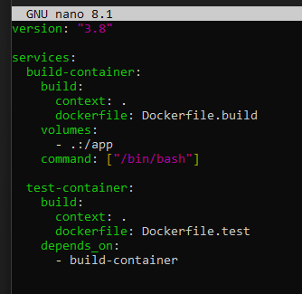
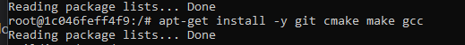

# Szymon Dernoga Sprawozdanie 1
## Lab1
Zacząłem od zainstalowania klienta git(jakiś dziwny zamiast po prostu git desktop, ale git bash został z nim zainstalowany, potem wziłąem jeszcze git desktop)

Następnie dodałem klucze ssh

Kolejno pobrałem za pomocą https i psa nasze repozytorium

Następnie pobrałem za pomocą ssh:

Dodatkowo ustawiłem 2fa:

Następnie przełączyłem się na swoją gałąż oraz dodałem do niej githooka (jak inne rzeczy znajdują się one w folderze):

[githook](./lab1/commit-msg)

## lab2

Zainstalowałem Docker w systemie linuksowym

Zarejestrowałem się w docker hub i zapoznałem z obrazami

Pobrałem obrazy hello-world, busybox lub fedora, mysql

Uruchomiłem kontener busy box oraz podłączyłem się do niego interaktywnie aby pokazać w nim procesy:

Uruchomiłem "system w kontenerze" (czyli kontener z obrazu ubuntu) i pokazałem w nim procesy

Oraz zaktualizowałem pakiety

Następnie stworzyłem plik dockerfile [dockerfile](./lab2/dockerfile_lab2)

I sklonowałem nasze repo

Pokazałem uruchomione ( != "działające" ) kontenery, wyczyściłem je i obrazy

Historia poleceń

## lab3

Skorzystałem z chatagpt oto co zostało zapytane i odpowiedź: [chat](./lab3/chatgpt.txt)

Znalazłem otwarte oprogramowanie na zajecią i pobrałem je w dockerze:

oraz zbudowałem

i wykonałem testy jednostkowe

Następnie powtórzyłem te same kroki w kontenerze ubuntu uruchomionym interaktywnie

Następnie stworzyłem dwa pliki dockerfile, jeden do wszystkiego poza testami i jeden do testów

Następnie ujołem kontenery w kompozycje

Oto odpowiedzi na pytanie z rozszerzenia [pob](./lab3/roz.txt)

I lista poleceń [pob](./lab3/polecenia_podstawa.txt)

## lab4

Skorzystałem z chatagpt oto co zostało zapytane i odpowiedź: [chat](./lab4/chatgpt4.txt)

Na potrzeby projektu przygotowałem dwa woluminy Dockera — jeden wejściowy i jeden wyjściowy. Nadałem im dowolne nazwy: vol_input i vol_output. Uruchomiłem kontener bazowy na obrazie ubuntu, podłączając oba woluminy – jeden do ścieżki /app/src, a drugi do /app/build.

Po uruchomieniu kontenera sprawdziłem, że posiada wszystkie niezbędne zależności potrzebne do budowania projektu (takie jak kompilatory, interpretery itp.), z wyłączeniem gita, który nie był potrzebny wewnątrz kontenera.

Repozytorium projektu sklonowałem spoza kontenera, bez potrzeby instalacji dodatkowych narzędzi w jego wnętrzu. Użyłem polecenia, które sklonowało repozytorium bezpośrednio do woluminu wejściowego, wskazując jego ścieżkę na hoście. W ten sposób kod źródłowy znalazł się automatycznie w katalogu /app/src widocznym wewnątrz kontenera.

Dzięki temu mogłem natychmiast przystąpić do budowania projektu wewnątrz kontenera, a gotowe pliki wynikowe zostały zapisane do woluminu wyjściowego i były dostępne także poza kontenerem.

Utworzyłem woluminy vol_input i vol_output, podłączyłem je do kontenera (/app/src, /app/build). Repozytorium sklonowałem spoza kontenera bezpośrednio do woluminu wejściowego. W kontenerze skopiowałem kod do lokalnego katalogu, zbudowałem projekt, a wynikowe pliki zapisałem w woluminie wyjściowym. Były dostępne po zamknięciu kontenera.

W kontenerze doinstalowałem git, sklonowałem repo do /app/src. Zbudowałem projekt i przeniosłem wynik do /app/build (wolumin wyjściowy). Wyniki również były trwałe.

Można to wszystko zautomatyzować w Dockerfile, klonując repo i wykonując build już na etapie docker build, co zwiększa powtarzalność i upraszcza proces.

historia do tej pory [his](./lab4/historia1.txt)

Zapoznałem się z dokumentacją na stronie iperf.fr oraz docker network create. Następnie uruchomiłem kontener z zainstalowanym iperf3 w trybie serwera. W osobnym kontenerze uruchomiłem iperf3 jako klient, łącząc się z serwerem i mierząc przepustowość.

Zamiast domyślnej sieci, utworzyłem własną sieć mostkową o nazwie siec_testowa. Dzięki temu mogłem łączyć się z serwerem za pomocą nazwy kontenera, np. iperf-serwer, a nie adresu IP. Oba kontenery działały poprawnie w tej sieci i komunikowały się bez problemu.

Z hosta połączyłem się z kontenerem-serwerem (mapując port 5201 na localhost). Połączenie z zewnętrznego hosta wymagało przekierowania portu i otwartego firewalla – tu mogą wystąpić ograniczenia, zwłaszcza w sieciach NAT lub VPN.

Dane z iperf3 (logi z testów przepustowości) zapisałem do woluminu podpiętego do kontenera-klienta. Dzięki temu miałem dostęp do wyników także po zakończeniu działania kontenera. Przepustowość między kontenerami była bardzo wysoka (typowo > 10 Gbps, zależnie od hosta), natomiast z zewnątrz – ograniczona przez interfejs sieciowy hosta.

historia do tej pory [his](./lab4/historia2.txt)

