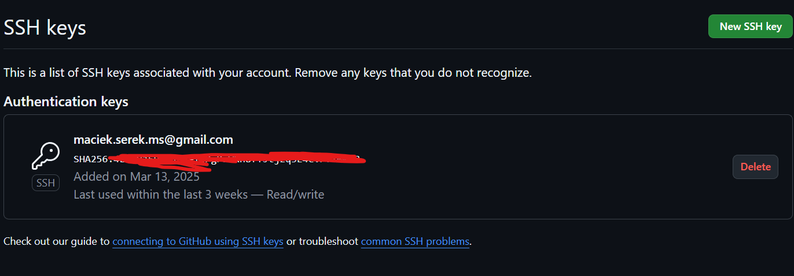
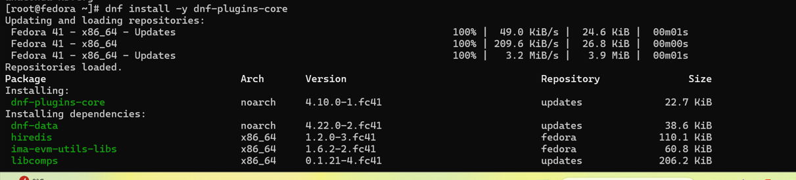
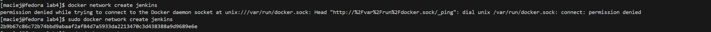

# Sprawozdanie 1
## Maciej Serafin [MS416436]

---
Repozytoria programów:
- https://github.com/irssi/irssi
- https://github.com/devenes/node-js-dummy-test

---

### 1. Instalacja klienta Git i obługi kluczy SSH

- Instalacja git na maszynie wirtualnej Fedora.
```
$ sudo dnf update
$ sudo dnf upgrade
$ sudo dnf install git
```

- Instalacja dodatkowej obsługi plików nano.

```
$ sudo dnf install nano
``` 
-  Zrzut ekranu przedstawiający zainstalowane wersje


---
### 2. Sklonowanie repozytorium za pomocą klucza SSH

- Wygenerowanie par kluczy SSH

```
$ ssh-keygen -t ed25519 -C "email"
```


- Konfiguracja klucza jako metody dostępu do GitHuba

Do wyciągnięcia klucza publicznego wykorzystano komendę `cat ~/.ssh/id_ed25519.pub`




- Sklonowanie repozytorium z wykorzystaniem protokołu SSH

```
$ git clone git@github.com:InzynieriaOprogramowaniaAGH/MDO2024_INO.git
```


### 4. Przełączenie na gałąź main, następnie na gałąź swojej grupy

- Wyświetlenie listy gałęzi w repozytorium
```
$ git branch
```
- Utworzenie nowej gałęzi
```
$ git checkout
```
- Utworzenie nowej gałęzi i jednoczesne przełączenie się na nią
```
$ git checkout -b 
```
---
### 5. Utworzenie git hooka - skryptu weryfikującego

- Stworzenie pliku hooka

```
$ touch pre-commit
```

- Napisanie skryptu weryfikującego wiadomości commitów


- Upewnienie, że plik hooka jest wykonywalny
```
$ chmod +x pre-commit
```
---
### 6. Wysyłanie zmian do zdalnego źródła

- Wyświetlanie informacji o aktualnym stanie repozytorium

```
$ git status
```

- Dodanie wszystkich zmienionych plików wewnątrz katalogu `ITE` do indeksu w repozytorium 

```
$ git add .
```


- Zatwierdzenie zmian w repozytorium Git wraz z wiadomością

```
$ git commit -m "wiadomosc"
```

- Wysłanie zatwierdzonych zmian (commitów) z lokalnego repozytorium Git do zdalnego

```
$ git push
```


### 7. Instalacja docker na Fedorze

- Wykonanie kolejno poleceń

```
$ dnf install -y dnf-plugins-core
```
```
$ dnf install docker-ce docker-ce-cli containerd.io docker-buildx-plugin docker-compose-plugin
```
```
$ systemctl enable --now docker
```



### 8. Pobranie obrazów

- Pobranie obrazów hello-world, busybox, fedora, ubuntu

```
$ sudo docker pull hello-world
```
```
$ sudo docker pull busybox
```
```
$ sudo docker pull fedora
```
```
$ sudo docker pull ubuntu
```

- Zrzut ekranu prezentujący pobrane obrazy


### 9. Uruchomienie kontenera z obrazu busybox

```
$ sudo docker run --it busybox
```
- Opcja  `-it` podpięcie obecnego w trybie interaktywnym


- Uruchomione kontenery


- Zakończenie pracy kontenera
```
$ docker stop nazwa_kontenera
```

### 10. "System w kontenerze"

- Uruchomienie kontenera z obrazu ubuntu

```
$ docker run -it --name system-container ubuntu /bin/bash
```

- Wyświetlenie PID1 oraz pracesów dockera na hoście

```
# PID1 w kontenerze
$ ps -p 1

# Procesy Dockera na hoście
$ ps aux | grep docker
```

- Aktualizacja pakietów w kontenerze Ubuntu

```
$ apt update
$ apt upgrade
```
- Wyjście z kontenera

```
$ exit
```

### 11. Plik Dockerfile

- Utworzenie pliku Dockerfile


- Zbudowanie obrazu
```
$ docker build -t moj_obraz .
```


- Sprawdzenie obrazów


- Uruchomienie kontenera z utworzonego obrazu `moj_obraz`

```
$ docker run moj_obraz
```


Pomyślnie udało się sklonować repozytorium.

- Aktywne kontenery

```
$ docker ps -a
```

- Usuwanie kontenerów
```
$ docker rm nazwa_kontenera
```

```
$ docker rm id_kontenera
```


### 12. Przeprowadzenie buildu w kontenerze (irssi)

- Izolacja środowiska uruchomieniowego w kontenerze. Klonujemy repozytorium.

```
$ git clone https://github.com/irssi/irssi.git
```

- Instalacja potrzebnych zależności

```
$ dnf install git meson gcc glib2-devel openssl-devel ncurses-devel utf8proc-devel perl-ExtUtils-Embed perl
```

- Zbudowanie aplikacji i uruchomienie testów.

```
$ meson Build
```
W katalogu irssi/Build
```
$ ninja test
```


- Uruchomienie kontenera z obrazu Fedory

```
$ docker run -it --rm fedora bash
```

- Utworzenie pliku Dockerfile.irssibld - do budowania aplikacji.


- Utworzenie pliku Dockerfile.irssitest - do tworzenia obrazu z uruchomionymi testami.


- Do zbudowania obrazu kontenera używamy polecenia

```
$ docker build -f dockerfiles/Dockerfile.irrsibld -t irssibld .
```
- Po wykonaniu tego polecenia, Docker tworzy obraz na podstawie pliku Dockerfile.irrsibld, który zawiera instrukcje potrzebne do zbudowania naszej aplikacji. Obraz ten oznaczamy tagiem irssbld.

- Z zbudowanego obrazu możemy uruchomić kontener poleceniem:
```
$ docker run irssbld 
```

- Ten kontener nie jest przeznaczony do ciągłego działania ani interaktywnej pracy – jego jedynym zadaniem jest budowanie aplikacji. Po zakończeniu tego procesu automatycznie się wyłącza.

- Aby przetestować aplikację, konieczne jest stworzenie nowego obrazu Dockera, który będzie obsługiwał uruchamianie testów. W tym celu wykorzystujemy specjalnie przygotowany Dockerfile.


```
$ docker build -f  dockerfiles/Dockerfile.irssitest .
```

- Dzięki takiemu podejściu oddzielamy proces budowania (irssibld) od testowania (irssitest), co zapewnia lepszą organizację i modularność. Każdy z tych obrazów służy wyłącznie do określonych celów i nie uruchamia aplikacji ani testów automatycznie. Aby przeprowadzić te operacje, konieczne jest użycie odpowiedniego Dockerfile w trakcie budowania kontenerów.

### Aplikacja w node

Uruchomienie interaktywne kontenera poleceniem:
```
$ sudo docker run --rm -it node /bin/bash
```
Aktualizacja listy dostępnych pakietów i ich wersji:
```
$ apt-get update
```
Sklonowanie repozytorium:
```
$ git clone https://github.com/devenes/node-js-dummy-test
```
W katalogu node-js-dummy-test instalujemy potrzebne zależności:
```
$ npm install
```
Uruchomienie testów:
```
$ npm run test
```

#### Automatyzacja procesu korzystając z plików Dockerfile

- Utworzenie plików *Dockerfile.nodebld, Dockerfile.nodetest*


- Zbudowanie wszystkiego, sprawdzenie czy wszystkie dockerfile działają poprawnie


- Commit wszystkich dockerfile


 
### Lab 04


- Zbudowanie obrazu kontenera z poprzednich labów.


- Przygotowanie woluminów wejściowego i wyjściowego oraz podłączenie ich do kontenera bazowego.

```
$ docker volume create name
```


- Uruchomienie kontenera

```
$ docker run -it --name base-cont -v input_volume:/input -v output_volume:/output node-base bash
```


- Skopiowanie repozytorium do wolumina wejściowego
```
$ sudo docker cp /home/maciej/MDO2025_INO/lab3/lab4/node-js-dummy-test base-cont:/input
```

- Instalacja zależności, usuwanie podatności i testowanie

```
npm install
```
```
npm audit --force
```
```
npm test
```


- Przeniesienie zbudowanego programu do woluminu wyjściowego

```
$ cp -r /input/node-js-dummy-test/ /output/
```


#### Eksponowanie portu

- Pobranie i uruchomienie obrazu
```
$ docker pull networkstatic/iperf3
```


```
$ docker run -it --name=base-cont -p 5201:5201 networkstatic/iperf3 -s
```


- Zbadanie ruchu

```
$ docker inspect base-cont
```


- Podłączenie się z drugiego kontenera

```
$ docker run -it --rm networkstatic/iperf3 -c 172.17.0.2
```


- Pobranie iperf3 na hoscie pomocniczym zewnetrznym

```
$ sudo apt install iperf3
```

- Łączenie się z hosta i zbadanie ruchu

```
$ iperf3 -c localhost -p 5201
```


- Połączenie się spoza hosta i zbadanie ruchu

```
$ iperf3 -c 192.168.68.115 -p 5201
```


- Wyciągnięcie logów

```
$ docker logs iperf-server > logs.txt
```


#### Instancja Jenkins

1. Wykonanie kolejno instrukcji instalacji Jenkinsa

```
$ docker network create jenkins
```


```
$ docker run \
  --name jenkins-docker \
  --rm \
  --detach \
  --privileged \
  --network jenkins \
  --network-alias docker \
  --env DOCKER_TLS_CERTDIR=/certs \
  --volume jenkins-docker-certs:/certs/client \
  --volume jenkins-data:/var/jenkins_home \
  --publish 2376:2376 \
  docker:dind \
  --storage-driver overlay2
```


- Utworzenie dockerfile 
```
$ nano Dockerfile

```


- Stworzenie kontenera
```
$ docker build -t myjenkins-blueocean:2.492.2-1 .
```


```
$ docker run \
  --name jenkins-blueocean \
  --restart=on-failure \
  --detach \
  --network jenkins \
  --env DOCKER_HOST=tcp://docker:2376 \
  --env DOCKER_CERT_PATH=/certs/client \
  --env DOCKER_TLS_VERIFY=1 \
  --publish 8080:8080 \
  --publish 50000:50000 \
  --volume jenkins-data:/var/jenkins_home \
  --volume jenkins-docker-certs:/certs/client:ro \
  myjenkins-blueocean:2.440.2-1
```


- Działające kontenery
```
$ docker ps
```


- Po wejściu na ip_maszyny(192.168.56.115):8080 okno jenkinsa wymagajace hasla

- Uzyskanie hasła za pomocą komendy
```
docker exec jenkins-blueocean cat /var/jenkins_home/secrets/initialAdminPassword
```

- Po wpisaniu hasła zainstalowanie wtyczek


- Utworzenie konta i rozpoczecie pracy z Jenkins


