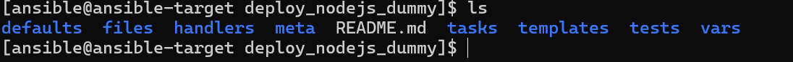
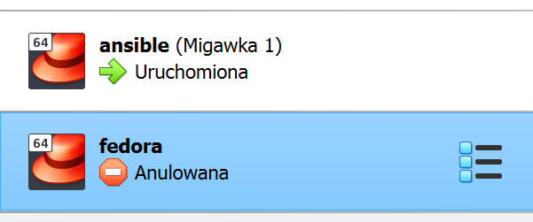
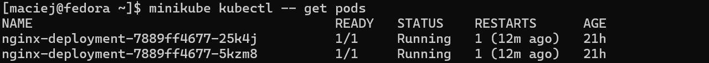
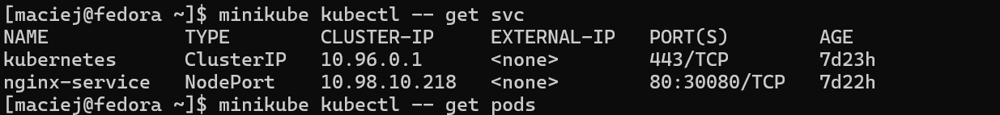
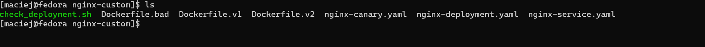
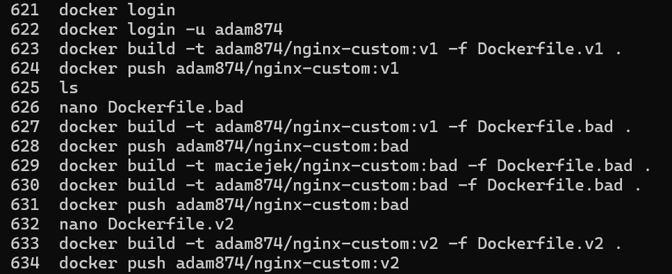
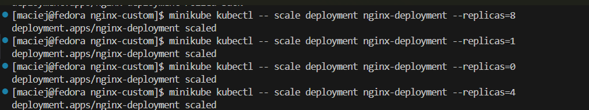
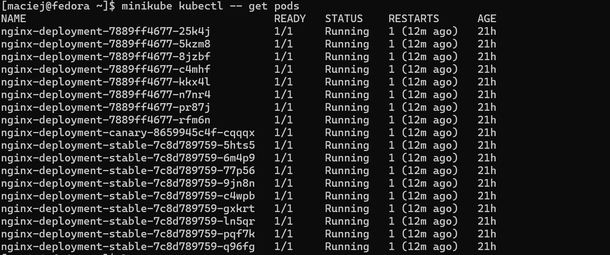

# Sprawozdanie 4
## Maciej Serafin [MS416436]

---

##### Cel laboratorium
Celem laboratorium było praktyczne zapoznanie się z narzędziem Ansible, służącym do automatyzacji zadań związanych z konfiguracją systemów, wdrażaniem aplikacji oraz zarządzaniem infrastrukturą. Ansible to bezagentowe, otwartoźródłowe rozwiązanie, które komunikuje się z maszynami zdalnymi za pośrednictwem protokołu SSH, co eliminuje potrzebę instalacji dodatkowego oprogramowania na hostach docelowych.

Oprócz pracy z Ansible, uczestnicy mieli za zadanie przeprowadzić automatyczną instalację systemu operacyjnego na podstawie pliku odpowiedzi Anacondy, a następnie wystawić aplikację (Nginx) na zewnątrz maszyny za pomocą Kubernetes w środowisku Minikube. Kolejnym etapem było skalowanie podów aplikacji, a także testowanie różnych strategii wdrażania (Recreate, Rolling Update, Canary Deployment) oraz możliwość wykonania rollbacku w razie niepowodzenia aktualizacji.

### Instalacja Zarządcy Ansible
1. Stworzenie nowej maszyny z której będziemy puszczać ansibla

2. Zainstalowanie wszystkich potrzebnych narzędzi w tym ansible, openssh itp. oraz utworzenie migawki maszyny.

3. Wymiana między maszynami docelowymi kluczy ssh aby ansible wykonywał się bez podawania hasła.


4. Puszczenie pinga na obie maszyny w celu sprawdzenia "czy siebie widzą" za pomocą komendy ansiblowej.


5. Puszczenie pinga za pomocą skryptu ansiblowego.

```
- name: Ping all machines
  hosts: all
  tasks:
    - name: Ping all machines
      ping:
```

inventory.ini
```
[Endpoints]
maciej ansible_host=192.168.56.115 ansible_user=maciej
```

```
ansible-playbook master.yml
```


6. Utworzenie skryptu ansiblowego, który przeprowadza cały proces postawienia kontenera nodejsdummytest wraz z zainstalowaniem potrzebnych tool'i.

inventory.ini
```
[Orchestrators]
ansible ansible_host=192.168.56.119 ansible_user=ansible

[Endpoints]
maciej ansible_host=192.168.56.115 ansible_user=maciej
```

main.yml
```
---
- name: Install Docker and Docker Compose
  ansible.builtin.dnf:
    name:
      - moby-engine
      - docker-compose
    state: present

- name: Ensure Docker service is enabled and running
  ansible.builtin.service:
    name: docker
    enabled: yes
    state: started

- name: Clone node‑js‑dummy‑test repo
  ansible.builtin.git:
    repo: https://github.com/devenes/node-js-dummy-test.git
    dest: /opt/nodejs-dummy-test
    version: master
    force: yes

- name: Create Dockerfile for custom nodejs image
  copy:
    dest: /opt/nodejs-dummy-test/Dockerfile
    content: |
      FROM node:16-alpine
      WORKDIR /app
      COPY package.json package-lock.json ./
      RUN npm ci --only=production
      COPY . .
      EXPOSE 3000
      CMD ["npm", "start"]

- name: Build custom Docker image for node‑js‑dummy‑test
  become: true
  ansible.builtin.docker_image:
    name: nodejs_dummy_img
    source: build
    build:
      path: /opt/nodejs-dummy-test
      dockerfile: Dockerfile

- name: Run node‑js‑dummy‑test container
  ansible.builtin.docker_container:
    name: nodejs_dummy_test
    image: nodejs_dummy_img
    state: started
    published_ports:
      - "3000:3000"
    env:
      NODE_ENV: production
    restart_policy: unless-stopped

- name: Verify Docker container is running
  ansible.builtin.docker_container_info:
    name: nodejs_dummy_test
  register: container_status

- name: Container is running ✔
  debug:
    msg: "Docker container is running"
  when: container_status.container.State.Status == 'running'

- name: Container failed to start ⚠
  debug:
    msg: "Docker container failed to start"
  when: container_status.container.State.Status != 'running'

```




Podsumowanie
Wykorzystanie Ansible do zarządzania kontenerami Docker pozwoliło na skuteczne zautomatyzowanie procesów wdrażania aplikacji. Zastosowanie playbooków umożliwiło łatwe i powtarzalne uruchamianie oraz kontrolowanie cyklu życia kontenerów, co znacząco uprościło zarządzanie infrastrukturą. Dzięki temu możliwe było szybkie dostosowanie środowiska do bieżących potrzeb, co jest niezwykle istotne w elastycznych, nowoczesnych systemach IT. Cały proces został szczegółowo udokumentowany przy użyciu zrzutów ekranu, które ilustrują każdy kluczowy etap — od konfiguracji po uruchomienie aplikacji.

---
### Instalacje nienadzorowane

1. Instalacja systemu Fedora na nowo utworzonej wirtualnej maszynie



2. Uzyskanie dostępu do pliku `anaconda-ks.cfg`
```
sudo nano root/anaconda-ks.cfg
```

Zmodyfikowanie pliku:
```
#version=DEVEL
# Generated by Anaconda

# Źródło instalacji (Fedora 41 x86_64)
url --mirrorlist=https://mirrors.fedoraproject.org/mirrorlist?repo=fedora-41&arch=x86_64
repo --name=updates --mirrorlist=https://mirrors.fedoraproject.org/mirrorlist?repo=updates-released-f41&arch=x86_64

# Podstawowe ustawienia
keyboard --vckeymap=us --xlayouts='us'
lang en_US.UTF-8
timezone Europe/Warsaw --utc
network --bootproto=dhcp --device=eth0 --onboot=on --hostname=fedora-pipeline

# Hasła
rootpw --iscrypted --allow-ssh $y$j9T$3F6q45XxYGu0cyIGXI4NSRUd$MvIVumHDikLlpwfRqEoa4g0HjVLyPR0RP8gY9SEV0n1
user --groups=wheel --name=maciej --password=$y$j9T$6aTAOaS3XpAv9EofJxD8uD7v$5A4lLbt62G7I65v6KlZvfmai/l01RTN4IUB6GTkDzS2 --iscrypted --gecos="maciej"

# Inne
firewall --enabled --service=ssh
selinux --enforcing
firstboot --disable
reboot

# Partycjonowanie
ignoredisk --only-use=sda
autopart
clearpart --all --initlabel


%packages
@^server-product-environment
docker
git
wget
curl
vim
%end


%post --log=/var/log/kickstart-post.log
echo "### Konfiguracja Dockera i uruchomienie kontenera..." > /dev/tty1


systemctl enable docker


cat <<EOF > /etc/rc.d/rc.local
#!/bin/bash
/usr/bin/dockerd &
sleep 10
/usr/bin/docker pull devenes/node-js-dummy-test:latest
/usr/bin/docker run -d -p 80:3000 devenes/node-js-dummy-test:latest
EOF

chmod +x /etc/rc.d/rc.local
%end

```

3. Wysłanie pliku na swojego github'a w celu późniejszej instalacji systemu właśnie z tego pliku.

4. Modyfikacja ścieżki w grubie podczas bootwania się systemu w celu instalacji fedory z githuba.


5. Uruchomienie instalacji.


Podsumowanie:
Na zajęciach przeprowadzono automatyczną instalację systemu Fedora z wykorzystaniem pliku Kickstart (anaconda.ks) pobranego z GitHub. Plik zawierał wszystkie niezbędne ustawienia instalacyjne, takie jak partycjonowanie, użytkownicy, instalowane pakiety (np. Docker, Git) oraz skrypt automatycznego uruchamiania kontenera po starcie. Instalacja została uruchomiona z poziomu gruba z odpowiednim parametrem startowym inst.ks= wskazującym na lokalizację pliku KS.


### Wdrażanie na zarządzalne kontenery: Kubernetes (1)

#### Instalacja klastra Kubernetes

1.  Instalacja i Uruchomienie Minikube

- Pobranie Minikube
```
curl -LO https://storage.googleapis.com/minikube/releases/latest/minikube-linux-amd64
```
- Instalacja Minikube
```
sudo install minikube-linux-amd64 /usr/local/bin/minikube
```
- Uruchomienie Minikube za pomocą sterownika docker
```
minikube start
```

Minikube to narzędzie umożliwiające lokalne uruchamianie klastra Kubernetes na komputerze deweloperskim. Instalacja polega na pobraniu odpowiedniego pliku binarnego, jego zainstalowaniu w systemie oraz uruchomieniu klastra. Minikube automatycznie tworzy jednowęzłowy klaster, co czyni je doskonałym rozwiązaniem do celów testowych, nauki i rozwoju aplikacji w środowisku zbliżonym do produkcyjnego.

2. Instalacja Kubectl
```
sudo snap install kubectl --classic
```

Kubectl jest narzędziem wiersza poleceń dla Kubernetes, które pozwala na zarządzanie klastrem, wdrożeniami i usługami.

3. Uruchomienie Dashboardu Kubernetes
```
minikube dashboard
```


4. Stworzenie aliasu żeby nie wpisywać cały czas minikube kubectl...

```
alias kubectl="minikube kubectl --"
```

5. Stworzenie plików deployment oraz service dla aplikacji nginx w celu zapply'owania aplikacji.

```
[maciej@fedora ~]$ cat nginx-deployment.yaml
apiVersion: apps/v1
kind: Deployment
metadata:
  name: nginx-deployment
spec:
  replicas: 4
  selector:
    matchLabels:
      app: nginx
  template:
    metadata:
      labels:
        app: nginx
    spec:
      containers:
      - name: nginx
        image: nginx:stable
        ports:
        - containerPort: 80
```


```
[maciej@fedora ~]$ cat nginx-service.yaml
apiVersion: v1
kind: Service
metadata:
  name: nginx-service
spec:
  selector:
    app: nginx
  type: NodePort
  ports:
    - protocol: TCP
      port: 80
      targetPort: 80
      nodePort: 30081
```

6. Apply plików yaml/

```
kubectl apply -f nginx-deployment.yaml
```

```
kubectl apply -f nginx-service.yaml
```

7. Sprawdzenie utworzenia się podów oraz serwisów.

```
kubectl get pods -A
```



```
kubectl get svc
```



8. Sprawdzenie działania aplikacji wewnątrz klastra.


9. Port forwordowanie w celu wyeksponowania aplikacji poza klaster oraz przepuszczenie portu w VS Code, nasłuchiwanie portu 8080 praz 30081 za pomocą netstata w celu sprawdzenia poprawności.

```
kubectl port-forward svc/nginx-service 8080:80
```


### Wdrażanie na zarządzalne kontenery: Kubernetes (2)

1. Stworzenie 3 obrazów nginx'a (jeden oryginalny, drugi ze zmienionym head'erem, trzeci który zawsze zwróci błąd).



- Dockerfile.v1

```
FROM nginx:stable
RUN echo '<h1>Wersja 1 - Działa</h1>' > /usr/share/nginx/html/index.html
```

- Dockerfile.v2

```
FROM nginx:stable
RUN echo '<h1>Wersja 2 - Nowa funkcjonalność</h1>' > /usr/share/nginx/html/index.html
```

- Dockerfile.bad

```
FROM nginx:stable
RUN rm -rf /etc/nginx
```

2. Zbudowanie obrazów oraz publish obrazów do DockerHuba.



```
docker build -t adam874/nginx-custom:v1 -f Dockerfile.v1 .
docker push adam874/nginx-custom:v1
```

- i tak z każym obrazem


3. Zbudowanie deploymentu oraz serwisu dla obrazów.


```
[maciej@fedora nginx-custom]$ cat nginx-deployment.yaml
apiVersion: apps/v1
kind: Deployment
metadata:
  name: nginx-deployment
spec:
  replicas: 4
  selector:
    matchLabels:
      app: nginx
  strategy:
    type: Recreate
  template:
    metadata:
      labels:
        app: nginx
        version: v1
    spec:
      containers:
      - name: nginx
        image: adam874/nginx-custom:v1
        ports:
        - containerPort: 80
```


```
[maciej@fedora nginx-custom]$ cat nginx-deployment.yaml
apiVersion: apps/v1
kind: Deployment
metadata:
  name: nginx-deployment
spec:
  replicas: 4
  selector:
    matchLabels:
      app: nginx
  strategy:
    type: Recreate
  template:
    metadata:
      labels:
        app: nginx
        version: v1
    spec:
      containers:
      - name: nginx
        image: adam874/nginx-custom:v1
        ports:
        - containerPort: 80
[maciej@fedora nginx-custom]$ cat nginx-service.yaml
apiVersion: v1
kind: Service
metadata:
  name: nginx-service
spec:
  selector:
    app: nginx
  type: NodePort
  ports:
    - protocol: TCP
      port: 80
      targetPort: 80
      nodePort: 30080
```

- Aplikacja deploymentu oraz serwisu

```
kubectl apply -f nginx-deployment.yaml
```

```
kubectl apply -f nginx-service.yaml
```

4. Zmiana ilości tworzenia się replik poszczególnych deploymentów i obserwacja zachowania



```
 643  kubectl scale deployment nginx-deployment --replicas=8
  644  minikube kubectl -- scale deployment nginx-deployment --replicas=8
  645  kubectl scale deployment nginx-deployment --replicas=1
  646  minikube kubectl -- scale deployment nginx-deployment --replicas=1
  647  ls
  648  nano nginx-deployment.yaml
  649  nano nginx-service.yaml
  650  minikube kubectl -- apply -f nginx-deployment.yaml
  651  minikube kubectl -- scale deployment nginx-deployment --replicas=0
  652  minikube kubectl -- scale deployment nginx-deployment --replicas=4
  653  alias kubectl="minikube kubectl --"
  654  kubectl set image deployment nginx-deployment nginx=maciejek/nginx-custom:v2
  655  ls
  656  nano Dockerfile.v2
  657  minikube kubectl -- scale deployment nginx-deployment --replicas=2
  658  minikube kubectl -- scale deployment nginx-deployment --replicas=4
  659  ls
  660  nano nginx-deployment.yaml
  661  nano nginx-service.yaml
  662  ls
  663  nano Dockerfile.v1
  664  nano Dockerfile.v2
  665  ls
  666  kubectl set image deployment nginx-deployment nginx=adam874/nginx-custom:v2
  667  minikube kubectl -- scale deployment nginx-deployment --replicas=2
```


5. Wykonanie rollout'u do poprzedniej wersji (z deploymentu z błędem do wersji v2).

```
kubectl rollout undo deployment nginx-deployment
```


- sprawdzenie historii rollout'ów

```
kubectl rollout history deployment nginx-deployment
```

- sprawdzenie statusu rollout'u naszego deploymentu

```
kubectl rollout status deployment nginx-deployment
```

6. Stworzenie pliku sprawdzający czy deployment wykonał się na czas (poniżej 60sekund).


7. Zmiana strategii na RollingUpdate oraz ustawienie zmiennej maxSurge na 25% oraz maxUnavailable > 1.


8. Zmiana strategii na Recreate.


```
[maciej@fedora nginx-custom]$ cat nginx-deployment.yaml
apiVersion: apps/v1
kind: Deployment
metadata:
  name: nginx-deployment
spec:
  replicas: 4
  selector:
    matchLabels:
      app: nginx
  strategy:
    type: Recreate
  template:
    metadata:
      labels:
        app: nginx
        version: v1
    spec:
      containers:
      - name: nginx
        image: adam874/nginx-custom:v1
        ports:
        - containerPort: 80
```


9. Stworzenie wdrożenia Canary Deployment workload

```
[maciej@fedora nginx-custom]$ cat nginx-canary.yaml
apiVersion: apps/v1
kind: Deployment
metadata:
  name: nginx-deployment-stable
  labels:
    app: nginx
    version: stable
spec:
  replicas: 9
  selector:
    matchLabels:
      app: nginx
      version: stable
  template:
    metadata:
      labels:
        app: nginx
        version: stable
    spec:
      containers:
      - name: nginx
        image: adam874/nginx-custom:v1
        ports:
        - containerPort: 80

---
apiVersion: apps/v1
kind: Deployment
metadata:
  name: nginx-deployment-canary
  labels:
    app: nginx
    version: canary
spec:
  replicas: 1
  selector:
    matchLabels:
      app: nginx
      version: canary
  template:
    metadata:
      labels:
        app: nginx
        version: canary
    spec:
      containers:
      - name: nginx
        image: adam874/nginx-custom:v2
        ports:
        - containerPort: 80

---
apiVersion: v1
kind: Service
metadata:
  name: nginx-service
spec:
  selector:
    app: nginx
  ports:
  - protocol: TCP
    port: 80
    targetPort: 80
  type: NodePort
```


10. Sprawdzenie działania wszystkich utworzonych podów.



Wnioski
Strategie wdrażania w Kubernetesie pozwalają dostosować sposób aktualizacji aplikacji do konkretnych potrzeb. Rolling Update minimalizuje przestoje, ale może częściowo wdrożyć błędną wersję. Recreate zapewnia czyste przejście, kosztem dostępności aplikacji w czasie aktualizacji. Canary Deployment umożliwia bezpieczne testowanie nowych wersji, ale wymaga bardziej złożonej konfiguracji i monitoringu.


