# Sprawozdanie z Projektu Zaliczeniowego: Metodyki DevOps

## 1. Wybór oprogramowania i uzasadnienie

Na potrzeby projektu wybrano oprogramowanie **Apache HTTP Server (httpd)**, jeden z najpopularniejszych serwerów WWW. Wybór ten został podyktowany następującymi kryteriami:

1.  **Działanie w kontenerze z wystawionym portem TCP**: Apache jest standardowym rozwiązaniem do konteneryzacji, a jego domyślny port do nasłuchiwania to `80`. Uruchomienie go w kontenerze jest proste i powszechnie stosowane.

2.  **Obecność testów w repozytorium**: Repozytorium źródłowe Apache'a jest zaopatrzone w obszerne testy. Znajdują się one w katalogu `test/`, co ułatwia weryfikację i spełnia kryterium projektu.

3.  **Stosowność licencji**: Apache jest rozpowszechniany na licencji **Apache 2.0**. Jest to licencja permisywna, która pozwala na swobodne wykorzystanie kodu, co w pełni kwalifikuje go do użycia w ramach niniejszego projektu.

## 2. Dowód działania aplikacji poza kontenerem

### Weryfikacja działania

Aby udowodnić, że Apache nasłuchuje na porcie `8080`, wykonano następujące kroki w konsoli systemowej.

**Krok 1: Weryfikacja gniazda nasłuchującego**

Użyto polecenia `lsof` lub `ss` (Socket Statistics), aby sprawdzić, czy proces Apache'a nasłuchuje na porcie `8080`:  

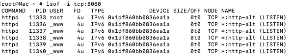

Powyższy wynik jednoznacznie pokazuje, że proces Apachejest w stanie `LISTEN` na wszystkich interfejsach (`0.0.0.0`) na porcie `8080`.

**Krok 2: Weryfikacja komunikacji z usługą**

Aby potwierdzić, że usługa odpowiada na żądania, użyto narzędzia `curl` do wysłania żądania HTTP GET:  

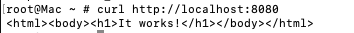

Weryfikacja graficzna

Po wpisaniu w przeglądarce adresu http://localhost:8080 widoczna jest domyślna strona Apache.  


Listing katalogu z testami

Testy dla Apache'a znajdują się w głównym repozytorium, w katalogu `test/`. Poniżej znajduje się listing jego struktury, który potwierdza obecność testów:  

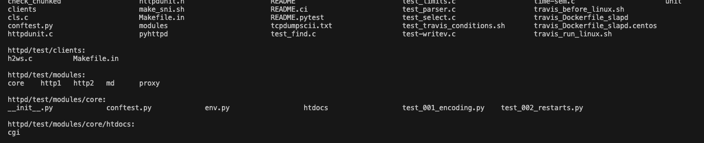

Jak widać, testy są zorganizowane w podkatalogu `test/`, co jest powszechną konwencją w tego typu projektach.

## 3\. Analiza licencji oprogramowania Apache 2.0

Oprogramowanie Apache HTTP Server jest rozpowszechniane na licencji **Apache License 2.0**, której kluczowe fragmenty znajdują się: https://github.com/apache/httpd?tab=Apache-2.0-1-ov-file#readme

Licencja ta jest **permisywna** i w pełni zezwala na wykorzystanie oprogramowania do celów niniejszego projektu. Poniżej znajduje się uzasadnienie:

  * **Swoboda wykorzystania i modyfikacji**: `Apache License 2.0` pozwala na użycie, modyfikowanie i rozpowszechnianie kodu źródłowego i binarnego. Umożliwia to budowanie własnego obrazu Docker.
  * **Zasady dotyczące atrybucji**: Licencja wymaga zachowania oryginalnej informacji o prawach autorskich oraz warunków licencji, co jest standardową praktyką.
  * **Patent grant**: Licencja zawiera sekcję `patent grant`, która chroni użytkowników przed pozwami patentowymi ze strony kontrybutorów, co jest dodatkową korzyścią.

Zatem, licencja Apache 2.0 jest w pełni zgodna z wymaganiami projektu.

## 4\. Dowód działania aplikacji wewnątrz kontenera

Weryfikacja działania

Aby wykazać, że Apache działa wewnątrz kontenera, przygotowano prosty `Dockerfile`. Poniżej przedstawiono jego zawartość.
```
FROM httpd:alpine
EXPOSE 80
```

Po zbudowaniu obrazu poleceniem `docker build -t my-apache .` i uruchomieniu go, wykonano następujące weryfikacje.

**Krok 1: Weryfikacja uruchomionego kontenera i nasłuchującego portu**

Użyto polecenia `docker ps` do listy uruchomionych kontenerów.  

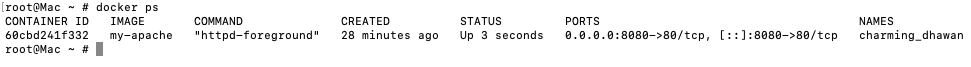

Wynik ten pokazuje, że kontener o nazwie `my-apache` jest uruchomiony, a jego port `80` jest mapowany na port `8080` hosta.

**Krok 2: Weryfikacja komunikacji z usługą**

Użyto narzędzia `curl` do komunikacji z serwerem Apache, ale tym razem za pośrednictwem zmapowanego portu `8080` na hoście.

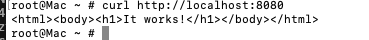

Weryfikacja graficzna

Po wpisaniu w przeglądarce adresu http://localhost:8080 widoczna jest domyślna strona powitalna Apache, co potwierdza działanie aplikacji wewnątrz kontenera i prawidłowe mapowanie portów.
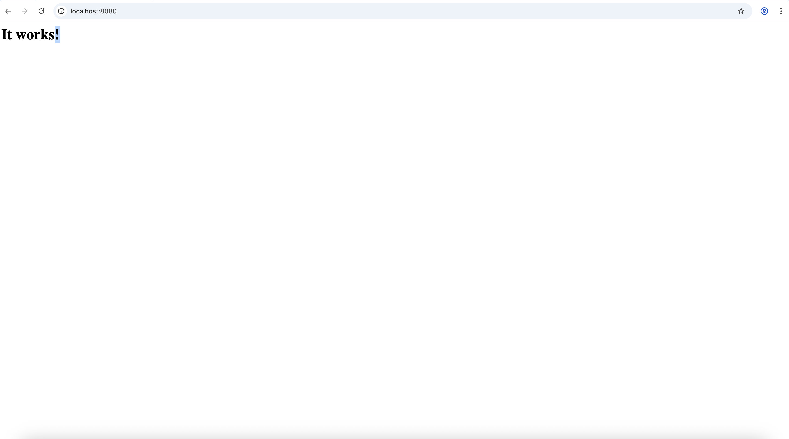

## 5. Dowód działania buildu i testów lokalnie bez kontenera

### Krok 1: Przygotowanie konfiguracji
```bash
./buildconf
```

### Krok 2: Konfiguracja projektu
```bash
./configure --enable-so --enable-ssl \
  --with-ssl=/opt/homebrew/opt/openssl@3 \
  --with-mpm=event \
  --with-included-apr
```

### Krok 3: Konfiguracja ścieżki instalacji i HTTP/2

```bash
./configure --prefix=$PWD/install --enable-http2
```

### Krok 4: Budowanie projektu

```bash
make -j$(sysctl -n hw.ncpu)
```
Rezultat:  

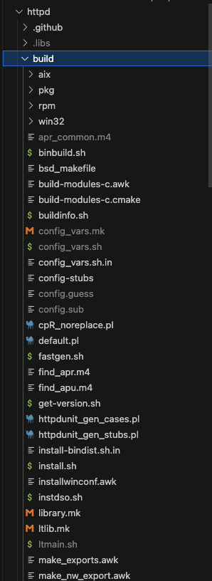

### Krok 5: Instalacja
```bash
make install
```

### Krok 6: Uruchomienie testów
```bash
pytest -vv
```

Rezultat:  
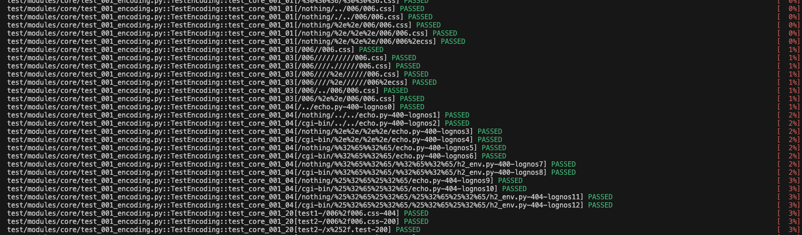


## 6. Konfiguracja Środowiska Jenkins

Celem zadania było przygotowanie w pełni funkcjonalnego środowiska do automatyzacji procesów CI/CD. W tym celu na maszynie wirtualnej z systemem Fedora Server zainstalowano i skonfigurowano serwer Jenkins, który następnie został zintegrowany z technologią Docker.


### Krok 1: Instalacja i uruchomienie Jenkins na Fedorze

Instancja Jenkins została uruchomiona na maszynie wirtualnej z systemem **Fedora Server** (wersja bez środowiska graficznego).

Proces instalacji Jenkinsa obejmował następujące kroki:  

1.  Instalacja wymaganej zależności - środowiska Java Development Kit w wersji 17: `sudo dnf install java-17-openjdk-devel`.
2.  Dodanie oficjalnego repozytorium Jenkins do menedżera pakietów `dnf`.
3.  Import klucza GPG w celu weryfikacji autentyczności pakietów.
4.  Instalacja Jenkinsa za pomocą komendy `sudo dnf install jenkins`.
5.  Uruchomienie i włączenie usługi Jenkins w systemie `systemd`, aby startowała automatycznie wraz z systemem (`systemctl start jenkins`, `systemctl enable jenkins`).

Uruchomienie nastepuje nastepujacym poleceniem:
```bash
docker run -d \
  --name jenkins \
  --restart=always \
  -p 8080:8080 -p 50000:50000 \
  -v jenkins_data:/var/jenkins_home \
  -V /VAR/RUN/DOCKER.SOCK:/VAR/RUN/DOCKER.SOCK \
  --network jenkins \
  -u root
  jenkins/jenkins:lts
```


### Krok 2:  Konfiguracja sieci i dostępności

Aby instancja Jenkins była dostępna z sieci lokalnej (spoza maszyny wirtualnej), podjęto następujące działania:  

1.  Konfiguracja karty sieciowej maszyny wirtualnej - w ustawieniach VirtualBox zmieniono tryb pracy karty sieciowej z `NAT` na `Bridged Adapter`. Dzięki temu maszyna wirtualna otrzymała własny adres IP w sieci hosta.

Dzięki tym zmianom, interfejs webowy Jenkinsa stał się dostępny z przeglądarki na maszynie-hoście pod adresem IP maszyny wirtualnej.

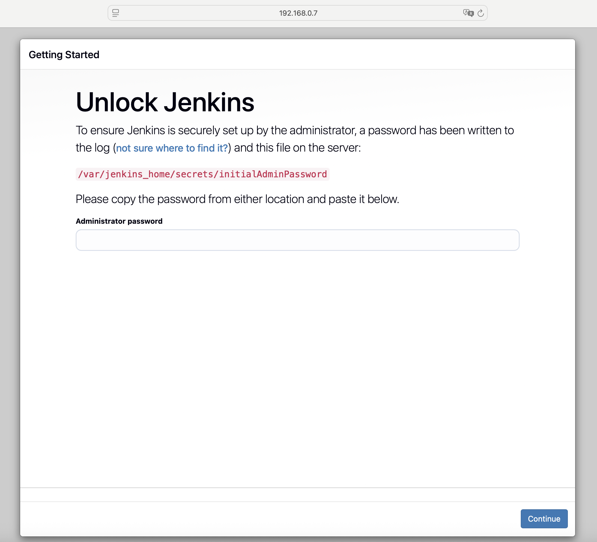

Wywolanie hasla domyslnego:  
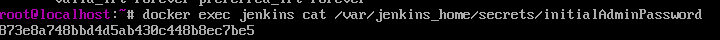

Tworzenie uzytkownika:
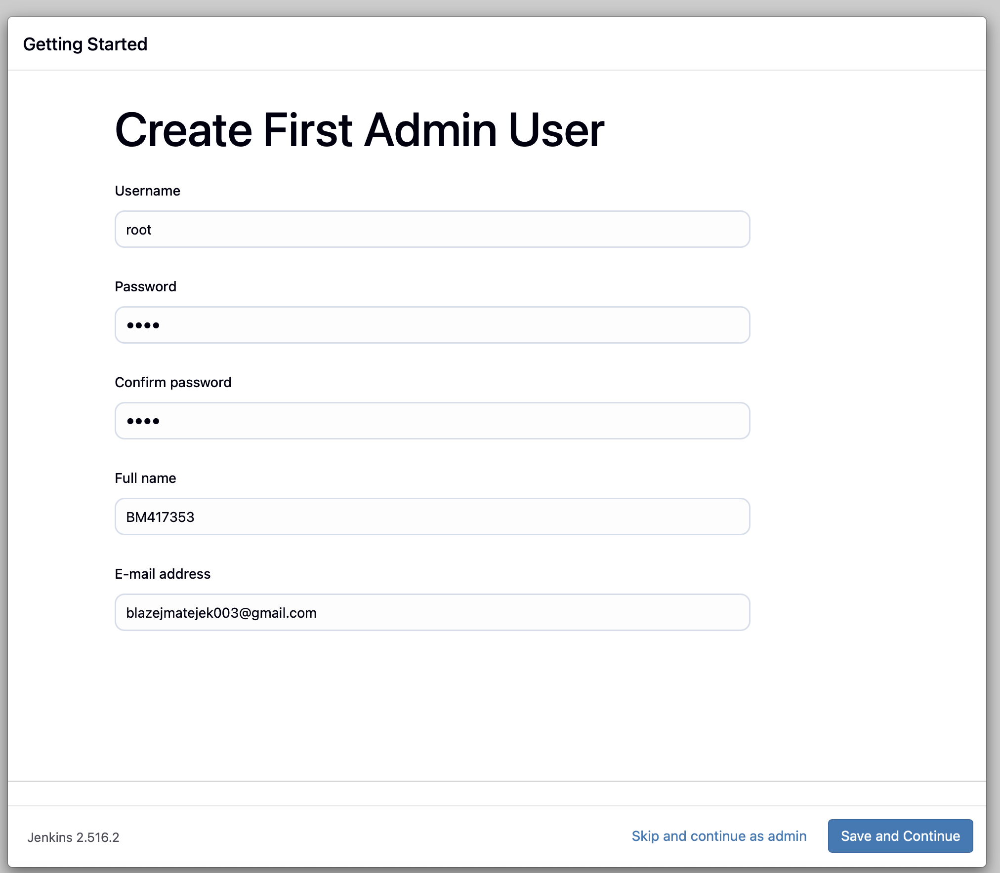

### Krok 3: Zabezpieczenie instancji

Po pierwszym uruchomieniu przeprowadzono standardową konfigurację Jenkinsa. W celu spełnienia wymagań bezpieczeństwa, aby tylko zalogowani użytkownicy mogli uruchamiać buildy i przeglądać pełne logi, zastosowano mechanizm **Matrix-based security**:  

1.  Dla grupy **Authenticated Users** (użytkownicy zalogowani) przyznano pełne uprawnienia do wszystkich operacji (Build, Read, Configure itp.).
2.  Dla użytkownika **Anonymous** (użytkownicy niezalogowani) odebrano kluczowe uprawnienia, w tym `Build > Build`, `Job > Read` (aby nie widzieli szczegółów zadań) oraz `Run > Replay`. Pozostawiono jedynie ogólne uprawnienie `Overall > Read`, aby strona główna była widoczna.

W ten sposób osoba niezalogowana nie może ani uruchomić nowego zadania, ani uzyskać dostępu do wrażliwych danych zawartych w logach konsoli.
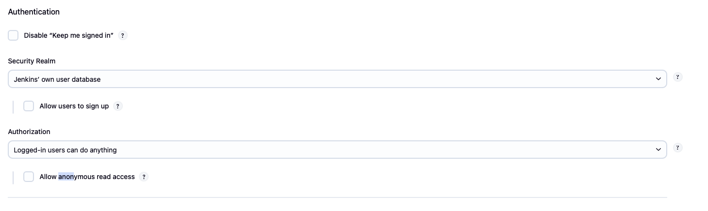

### 1.4. Integracja z Dockerem i Eksport VM

Jenkins do realizacji zadań w pipeline wykorzystuje Dockera. W tym celu na maszynie wirtualnej zainstalowano silnik Docker Community Edition. Kluczowym krokiem było nadanie uprawnień użytkownikowi `jenkins` do wykonywania poleceń `docker` bez konieczności używania `sudo`. Zrealizowano to poprzez dodanie użytkownika `jenkins` do grupy systemowej `docker` poleceniem: `sudo usermod -aG docker jenkins`. Po tej operacji usługa Jenkins została zrestartowana.

Po zakończeniu całej konfiguracji, gotowa maszyna wirtualna została wyeksportowana do pliku w formacie OVA. Plik ten stanowi kompletną, przenośną kopię zapasową skonfigurowanego środowiska.

## 7. Implementacja Pipeline CI/CD

Zgodnie z wymaganiami, stworzono zadanie typu **Pipeline**, które w deklaratywny sposób opisuje kroki budowy, testowania, wdrażania i publikacji oprogramowania (w tym przypadku serwera Apache httpd) w pliku `Jenkinsfile`.

### Krok 1: Etap `Build`

Celem tego etapu jest skompilowanie serwera Apache httpd ze źródeł w czystym i powtarzalnym środowisku kontenerowym.

* **Wybór i uzasadnienie kontenera bazowego:** Do budowania zależności (`Dockerfile.build-dependencies`) wybrano oficjalny obraz **`debian:bookworm-slim`**. Jest to obraz lekki, stabilny i szeroko stosowany w środowiskach produkcyjnych. Zawiera menedżer pakietów `apt`, który zapewnia łatwy dostęp do wszystkich niezbędnych narzędzi deweloperskich (`build-essential`, `git`, `libssl-dev`, `python3-venv` etc.).
* **Stworzenie obrazu z zależnościami:** Zamiast instalować zależności przy każdym uruchomieniu pipeline'u, stworzono dedykowany obraz `my-httpd-builder:latest`. Zawiera on wszystkie narzędzia i biblioteki potrzebne do skompilowania serwera httpd. Dzięki temu etap `Build` jest szybszy i bardziej niezawodny, ponieważ unika się problemów z siecią czy niedostępnością repozytoriów pakietów.
* **Proces budowania i widoczność logów:** Proces kompilacji (klonowanie repozytoriów `apr` i `apr-util`, uruchomienie `./buildconf`, `./configure`, `make` oraz `make install`) odbywa się wewnątrz kontenera uruchomionego z obrazu `my-httpd-builder`. Cały standardowy strumień wyjścia i błędów z tych poleceń jest przechwytywany przez Jenkins i wyświetlany w logach konsoli zadania, co zapewnia pełną widoczność postępu i ewentualnych problemów.

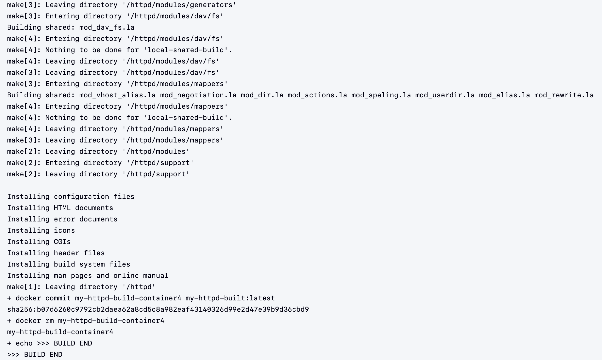

### Krok 2: Etap `Test`

W tym etapie weryfikowana jest poprawność działania świeżo skompilowanego oprogramowania.

* **Użycie "buildera" jako obrazu bazowego:** Jako podstawę do uruchomienia testów wykorzystano obraz `my-httpd-built:latest`, który został stworzony w poprzednim kroku poprzez `docker commit`. Zawiera on dokładnie te skompilowane pliki binarne, które mają zostać przetestowane. Gwarantuje to spójność między tym, co zostało zbudowane, a tym, co jest testowane.
* **Uruchomienie testów:** W kontenerze uruchomiono zestaw testów jednostkowych `pytest` dostarczony razem z kodem źródłowym Apache httpd. Użyto flagi `-vv` (bardzo szczegółowy tryb), aby uzyskać dokładne informacje o każdym przeprowadzanym teście.
* **Dostępność logów i analiza wyników:** Wyniki działania `pytest` są w całości widoczne w logach Jenkinsa. W przypadku powodzenia, widoczna jest lista testów ze statusem `PASSED`. Gdyby któryś z testów się nie powiódł, `pytest` wyświetliłby szczegółowy raport błędu (traceback), co pozwala na natychmiastową identyfikację problemu bez potrzeby ręcznego debugowania w kontenerze.

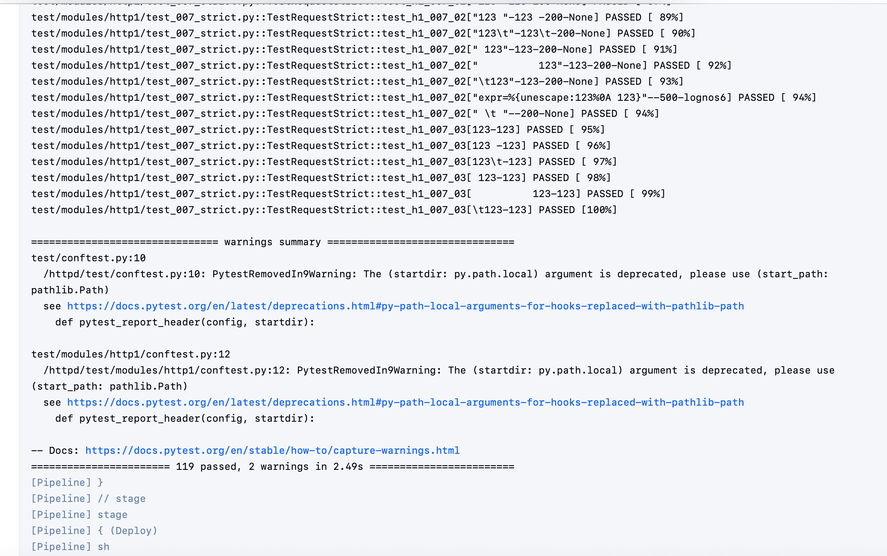

### Krok 3: Etapy `Deploy` i `Publish`

#### Wybór docelowej formy wdrożenia

Decydując o sposobie wdrożenia aplikacji, należy wziąć pod uwagę jej architekturę, środowisko docelowe oraz cykl życia. W przypadku serwera HTTP, najlepszym rozwiązaniem jest dystrybucja w postaci obrazu Docker, a nie tradycyjnych pakietów przenośnych (DEB/RPM/TAR/ZIP).

Uzasadnienie i dowód:

* Izolacja i spójność środowiska: Obraz Docker hermetyzuje aplikację i wszystkie jej zależności (biblioteki, pliki konfiguracyjne, system operacyjny) w jednym, niezależnym kontenerze. Eliminuje to problem tzw. "dependency hell", gdzie różne wersje bibliotek na hoście powodują błędy. Nasz serwer jest zbudowany ze źródeł, co wymaga skomplikowanego łańcucha narzędziowego. Dystrybucja go jako obrazu Docker eliminuje konieczność instalowania tych narzędzi na maszynie docelowej.

* Przenośność: Obraz Docker działa identycznie na każdym hoście z zainstalowanym silnikiem Docker, niezależnie od bazowego systemu operacyjnego. Zapewnia to przewidywalność i spójność w całym cyklu rozwoju, od środowiska deweloperskiego, przez testowe, aż po produkcyjne.

* Skalowalność i orkiestracja: Kontenery Docker są podstawowym elementem nowoczesnych platform orkiestracyjnych, takich jak Kubernetes czy Docker Swarm. Wybranie tej formy dystrybucji pozwala na łatwe skalowanie serwera w poziomie i automatyczne zarządzanie jego cyklem życia.

W przeciwieństwie do tego, pakiet DEB/RPM/TAR wymagałby manualnej instalacji na hoście i upewnienia się, że wszystkie zależności (np. libssl-dev, libapr1-dev) są dostępne w odpowiednich wersjach, co jest procesem bardziej podatnym na błędy.

Końcowe etapy pipeline'u odpowiadają za przygotowanie finalnego artefaktu oraz jego dystrybucję.

#### Skład pakietu redystrybucyjnego

Optymalny pakiet redystrybucyjny powinien być minimalistyczny i zawierać wyłącznie elementy niezbędne do uruchomienia aplikacji w środowisku produkcyjnym. Zgodnie z metodyką DevOps i zasadą "single responsibility", obraz produkcyjny nie powinien zawierać żadnych artefaktów z fazy budowania.

Zawartość obrazu Docker:

* Skompilowany artefakt binarny (/httpd/install).

* Pliki konfiguracyjne.

* Minimalny system operacyjny (np. alpine) i niezbędne biblioteki runtime.

Elementy, które nie powinny być zawarte:

* Sklonowane repozytorium (kod źródłowy) – jest to zbędny balast, który zwiększa rozmiar obrazu i może stanowić ryzyko bezpieczeństwa.

* Logi i artefakty z builda – są potrzebne tylko w fazie testowania i budowania. Ich obecność w obrazie produkcyjnym jest nieuzasadniona.

* Narzędzia deweloperskie (git, make, gcc) – zwiększają rozmiar obrazu i potencjalną powierzchnię ataku, a nie są potrzebne do działania serwera.

#### Opracowanie formy redystrybucyjnej w Jenkinsfile

Dostarczony Jenkinsfile idealnie realizuje te założenia, wykorzystując koncepcję wieloetapowego budowania, co zapobiega "puchnięciu" obrazu i przenoszeniu zbędnych warstw.

* **Faza Build**: Tworzony jest obraz my-httpd-built:latest, który zawiera cały łańcuch narzędziowy i artefakty po kompilacji. Jest to duży obraz, który służy wyłącznie do budowania i testowania.

* **Faza Deploy**: Artefakt, czyli skompilowany serwer, jest wyodrębniany z obrazu my-httpd-built za pomocą polecenia docker cp temp:/httpd/install ./install. Następnie, na podstawie czystego Dockerfile.deploy, tworzony jest nowy, minimalny obraz my-httpd:latest. Do tego obrazu kopiowane są wyłącznie niezbędne pliki serwera z wyodrębnionego wcześniej katalogu install. Ten proces jest kluczowy, ponieważ pokazuje, że użytkownik, pobierając finalny obraz, nie musi pobierać całej infrastruktury deweloperskiej.

* **Faza Publish** Oprócz obrazu Docker, Jenkinsfile tworzy również archiwum .tar.gz z plikami instalacyjnymi serwera, które jest archiwizowane (archiveArtifacts artifacts: 'my-httpd-install.tar.gz'). To pozwala na jego manualne pobranie, spełniając wymóg stworzenia co najmniej jednego elementu redystrybucyjnego.

#### Wersjonowanie

Pipeline stosuje jednoznaczną konwencję wersjonowania, która jest powszechnie stosowaną najlepszą praktyką w branży. Każdy pomyślny build jest tagowany w dwóch miejscach:  

* Tag latest: Zawsze wskazuje na najnowszą, stabilną wersję aplikacji.

* Tag BUILD_NUMBER: Nadaje obrazowi unikalny, niezmienny identyfikator powiązany z numerem uruchomienia Jenkinsa (np. bmatejek003/my-httpd:123).

Dzięki temu, deweloperzy i administratorzy mogą łatwo śledzić historię buildów, a w przypadku wykrycia błędu, bezproblemowo powrócić do poprzedniej, stabilnej wersji, po prostu odwołując się do jej numeru builda. To kluczowy element dla zapewnienia stabilności w środowisku produkcyjnym.

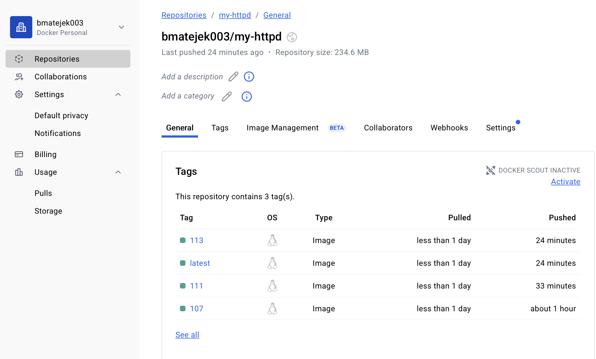

#### Wykazanie działania aplikacji

Jenkinsfile wykazuje, że aplikacja działa w sposób nieblokujący.

Polecenie docker run -d uruchamia kontener w tle (detached mode), pozwalając pipeline'owi na kontynuację.

Następnie, używając curl na losowym porcie, przeprowadzany jest smoke test, który weryfikuje, czy serwer poprawnie wystartował i odpowiada na zapytania HTTP. Jeśli curl zwróci błąd, pipeline jest przerywany, co sygnalizuje nieudane wdrożenie.

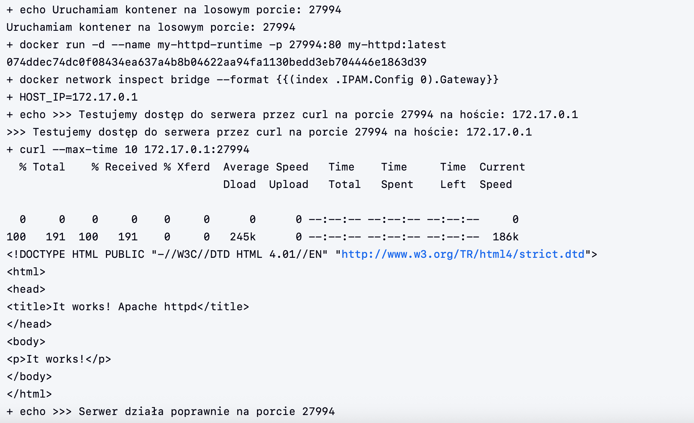

Ta technika udowadnia, że kontener z aplikacją jest sprawny i gotowy do obsługi ruchu, a jednocześnie nie blokuje dalszych etapów procesu CI/CD.

Sukces fazy Publish:  

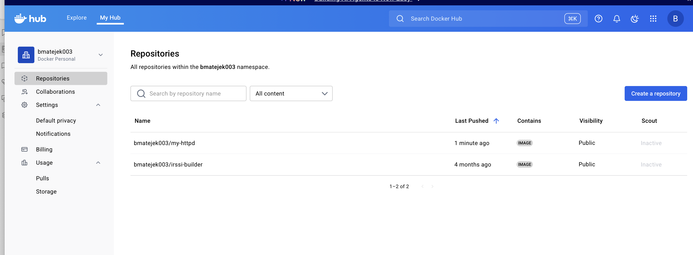

Build artefakty:
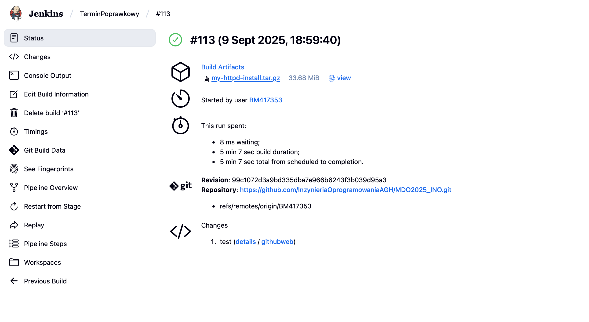